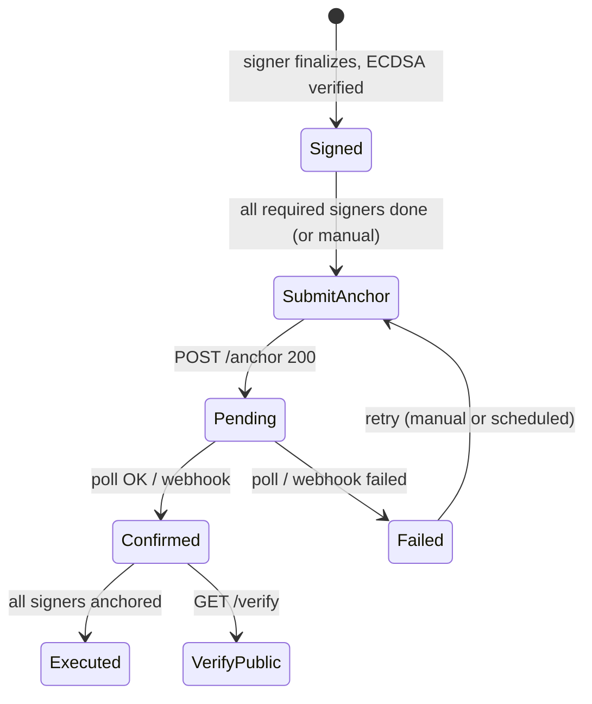

# Blockchain Integration Spec (External Anchoring Service)

> Status: **Draft — for reference**
> Created: 2026-08-15
> Repo: `diego-yason/pirma` · Branch: `dev`
> Related: `src/lib/server/db/schema.ts` (signatures, documents), `src/lib/shared/signing-payload.ts`, `src/routes/(app)/doc/[pageId]/sign/+page.server.ts`

## 1. Goal

Immutable, timestamped proof that a document was signed at a point in time, provided by an **external blockchain service** reached over HTTP. Pirma does not run any blockchain node or write to a chain directly — it only:

1. Computes a deterministic **artifact hash** per document — SHA-256 of the signed PDF/A
   artifact (`documents.signedArtifactHash`; Option B — the anchor covers exactly what the
   signers signed, including all embedded PAdES signatures).
2. Submits it to the anchoring service (`POST /anchor`).
3. Polls (or is webhook-notified) until confirmed.
4. Stores the returned proof locally and flips status `signed → anchored`.
5. Exposes public verification.

Currently the `signatures.status` enum already has `anchored` (`pending | signed | anchored | rejected`) but **nothing ever sets it**. This spec defines the missing piece.

## 2. Current state (what already exists)

| Thing                           | Where                               | Notes                                                                 |
| ------------------------------- | ----------------------------------- | --------------------------------------------------------------------- |
| `documents.hash` (SHA-256)      | `documents` table                   | Computed at upload in `doc/new/+page.server.ts`                       |
| `signatures.documentHash`       | `signatures` table                  | One row per document per signer                                       |
| `signatures.signaturePayload`   | `signatures` table                  | **Legacy — retired under Option B** (PAdES replaces the detached text-payload signature) |
| `signatures.signatureAlgorithm` | `signatures` table                  | **Legacy** — see above                                                |
| `signatures.status`             | `signatures` table                  | `pending/signed/anchored/rejected`                                    |
| `documents.status`              | `documents` table                   | `draft/finalized/executed` — `executed` TODO exists                   |
| Anchor input (Option B)         | `documents.signedArtifactHash`      | SHA-256 of the PAdES-signed PDF/A artifact (was: signing-payload hash) |
| "All signers done → executed"   | `sign/+page.server.ts`              | `// TODO: check if all signers are done → mark documents as executed` |

## 3. Architecture

```mermaid
flowchart LR
    A[Pirma Server] -->|POST /anchor| B[Blockchain Service]
    B -->|anchorId, txHash| A
    A -->|GET /anchor/:id (poll) | B
    B -->|webhook POST /api/blockchain/webhook| A
    A --> C[(Postgres: signature_anchors)]
    C --> D[(documents.status = executed)]
```

- **Anchoring service**: owns the chain, signing, batching, finality.
- **Pirma**: thin client, state machine, proof storage, verification UI.
- **On-chain data**: only hashes. Never raw document content, signature images, or PII.

## 4. External API contract (required surface)

All responses JSON. Auth via `Authorization: Bearer <key>` (or HMAC header — TBD with service owner).

### 4.1 `POST /anchor` — submit a hash

Request:

```jsonc
{
    "payloadHash": "sha256hex", // required
    "chain": "ethereum-l2", // optional, override default
    "metadata": { "documentId": "uuid" }, // optional, service-agnostic
}
```

Response `200`:

```jsonc
{
    "anchorId": "svc_abc123",
    "txHash": "0x...", // may be null until mined
    "status": "submitted", // submitted | pending | confirmed | failed
}
```

### 4.2 `GET /anchor/:anchorId` — poll status

Response `200`:

```jsonc
{
    "anchorId": "svc_abc123",
    "txHash": "0x...",
    "status": "confirmed", // submitted | pending | confirmed | failed
    "blockNumber": 18234567,
    "blockHash": "0x...",
    "confirmations": 12,
    "timestamp": "2026-08-15T12:00:00Z", // block timestamp
    "error": null, // human-readable reason if failed
}
```

### 4.3 `GET /verify` — public proof check

Query: `?payloadHash=sha256hex` or `?anchorId=svc_abc123`

Response `200`:

```jsonc
{
    "anchored": true,
    "txHash": "0x...",
    "blockNumber": 18234567,
    "timestamp": "2026-08-15T12:00:00Z",
}
```

### 4.4 `POST /anchor/batch` — optional

Request: `{ "payloadHashes": ["h1", "h2"], "chain": "..." }`
Response: `{ "results": [{ "payloadHash", "anchorId", "status" }] }`

### 4.5 Webhook (optional but recommended)

Service calls `POST /api/blockchain/webhook` when an anchor confirms/fails.

```jsonc
{
    "anchorId": "svc_abc123",
    "txHash": "0x...",
    "status": "confirmed",
    "blockNumber": 18234567,
    "blockHash": "0x...",
    "confirmations": 12,
    "timestamp": "2026-08-15T12:00:00Z",
}
```

Pirma validates the payload with `BLOCKCHAIN_WEBHOOK_SECRET` (HMAC-SHA256 header).

### 4.6 Contract decisions to confirm with service owner

- Chain(s) supported and default.
- Confirmations threshold (finality).
- Idempotency: does re-submitting the same `payloadHash` return the existing `anchorId`?
- Rate limits / cost per anchor (for batching decisions).
- Availability/SLA and whether the service can replay proofs after being down (vs. Pirma storing `proofJson`).

## 5. Internal integration layer

### 5.1 `src/lib/server/blockchain/anchor-client.ts`

```ts
export interface AnchorClient {
    submit(payloadHash: string, metadata?: Record<string, unknown>): Promise<SubmitResult>;
    getStatus(anchorId: string): Promise<AnchorStatus>;
    verify(payloadHash: string): Promise<VerifyResult>;
}

export interface SubmitResult {
    anchorId: string;
    txHash: string | null;
    status: AnchorStatusEnum; // "submitted" | "pending" | "confirmed" | "failed"
}

export interface AnchorStatus {
    anchorId: string;
    txHash: string | null;
    status: AnchorStatusEnum;
    blockNumber: number | null;
    blockHash: string | null;
    confirmations: number | null;
    timestamp: string | null;
    error: string | null;
}

export interface VerifyResult {
    anchored: boolean;
    txHash: string | null;
    blockNumber: number | null;
    timestamp: string | null;
}
```

Requirements:

- Timeout per request (`BLOCKCHAIN_TIMEOUT_MS`, default 10s).
- Retry with exponential backoff for transient failures (`BLOCKCHAIN_MAX_RETRIES`, default 3).
- Request ID + structured logging via `$lib/server/logger` (tag `blockchain`).
- Never throw on "submitted/pending" — only throw on transport/auth/validation errors (caller decides retry policy).

### 5.2 `src/lib/shared/blockchain.ts`

Shared request/response types used by both the server client and any verification UI (single source of truth).

## 6. Data model

### 6.1 New table `signature_anchors` (Drizzle, `src/lib/server/db/schema.ts`)

> Migration rule: use `pnpm dlx drizzle-kit generate --name add_signature_anchors` — never hand-edit SQL or `drizzle/meta/_journal.json`.

```ts
export const anchorStatusEnum = pgEnum("anchor_status", [
    "submitted",
    "pending",
    "confirmed",
    "failed",
]);

export const signatureAnchors = pgTable(
    "signature_anchors",
    {
        id: uuid("id").primaryKey().defaultRandom(),
        documentId: uuid("document_id")
            .notNull()
            .references(() => documents.id),
        payloadHash: text("payload_hash").notNull().unique(),
        anchorId: text("anchor_id"), // service-side id
        txHash: text("tx_hash"),
        blockNumber: bigint("block_number", { mode: "number" }),
        blockHash: text("block_hash"),
        chain: text("chain"),
        status: anchorStatusEnum("status").notNull().default("submitted"),
        proofJson: jsonb("proof_json"), // merkle path / receipt (verify offline)
        submittedAt: timestamp("submitted_at").notNull().defaultNow(),
        confirmedAt: timestamp("confirmed_at"),
        attempts: integer("attempts").notNull().default(0),
        lastError: text("last_error"),
    },
    (table) => [
        index("signature_anchors_document_id_idx").on(table.documentId),
        index("signature_anchors_status_idx").on(table.status),
    ],
).enableRLS();
```

RLS policy:

- Public read: `id`, `payloadHash`, `txHash`, `blockNumber`, `blockHash`, `timestamp`, `status` (for verification page).
- Owner-write; service/anon can read public proof columns only.

### 6.2 `signatures` changes (Option B)

- **Retire `signaturePayload` / `signatureAlgorithm`** (the detached text-payload signature).
  PAdES embeds the signer's ECDSA signature in the PDF artifact instead; no real users, so the
  columns are dropped (or made nullable) in the migration.
- The `signatures.status = 'anchored'` transition is derived: when an anchor confirms, update all
  `signatures` rows for that `documentId` where status is `signed` → `anchored`. Optionally link
  via a nullable `anchorId` on `signatures` if per-signature anchoring is chosen (see §8
  decisions).

## 7. State machine & workflow



### 7.1 Trigger (recommended: auto-anchor)

In `finalize` action (`sign/+page.server.ts`), after signatures are stored, check **whether the document now has all required signers signed**. If yes:

1. Build the anchor hash (the artifact hash — see §8) for the document.
2. Check `signature_anchors` for an existing row (idempotent — no double submit).
3. `anchorClient.submit(payloadHash)` → insert/update `signature_anchors` row as `submitted/pending`.
4. Kick off confirmation (polling job or rely on webhook).

### 7.2 Confirmation

- **Polling path**: `src/lib/server/blockchain/poll-anchors.ts` — a `cron`/scheduled job selects `status in ('submitted','pending')`, calls `getStatus`, advances state.
- **Webhook path**: `src/routes/api/blockchain/webhook/+server.ts` — validate HMAC secret, look up by `anchorId`, update row.

### 7.3 On confirmed

1. Update `signature_anchors` (confirmed fields, `confirmedAt`).
2. `UPDATE signatures SET status = 'anchored' WHERE document_id = ? AND status = 'signed'`.
3. If all signers for the document anchored → `UPDATE documents SET status = 'executed'` (resolves the existing TODO).

### 7.4 On failed

1. Update row with `lastError`, `attempts + 1`.
2. `signatures.status` stays `signed` (document is still signed; anchor is the only thing missing).
3. Surface a banner to the owner (dashboard "needs anchoring") + allow manual re-submit. Do not silently drop.

## 8. Anchor hash spec (Option B)

Deterministic, canonical, collision-resistant, PII-free.

The anchored hash is the **artifact hash** — SHA-256 of the final PAdES-signed PDF/A bytes
(`documents.signedArtifactHash`). It is computed once at artifact generation (after flattening +
PAdES embedding) and reused for the anchor, so the on-chain proof covers exactly what the
signers signed.

```ts
// pseudo
payloadHash = sha256(signedPdfABytes); // = documents.signedArtifactHash
```

(Previously this spec hashed a canonical JSON of `documentHash` + per-signer `signaturePayload`;
that detached payload is retired under Option B.)

Rules:

- Sort signers by `signerUserId` (not insertion order).
- Use a canonical JSON serializer (no whitespace variance) — e.g. `JSON.stringify` with sorted keys.
- Never include names/emails/document content — only hashes + signatures + timestamps.

If per-document hashing proves too coarse, fall back to per-signature anchoring (see §8 decisions).

## 9. Public verification

- **Page**: `/verify?hash=<payloadHash>` (public route) renders anchored status, txHash, block number, timestamp.
- **API**: `GET /api/verify/:anchorId` or `GET /api/verify?hash=` — checks local `signature_anchors`, then optionally cross-checks with service `GET /verify`.
- Offline capability: because `proofJson` is stored locally, verification can succeed even if the external service is down (recompute + validate Merkle path).

## 10. Configuration (`.env`)

```
BLOCKCHAIN_API_URL=
BLOCKCHAIN_API_KEY=
BLOCKCHAIN_CHAIN=
BLOCKCHAIN_CONFIRMATIONS=
BLOCKCHAIN_TIMEOUT_MS=
BLOCKCHAIN_MAX_RETRIES=
BLOCKCHAIN_WEBHOOK_SECRET=
BLOCKCHAIN_ANCHOR_ON_FINALIZE=true   # auto-anchor vs. manual only
```

Add to `.env.example`.

## 11. Security & correctness considerations

- **Server-side only**: anchoring calls happen in `+page.server.ts` / jobs, never in client code; `BLOCKCHAIN_API_KEY` is a private env var.
- **Idempotency**: unique `payloadHash`; never double-submit.
- **Webhook auth**: HMAC-SHA256 header verified against `BLOCKCHAIN_WEBHOOK_SECRET`.
- **RLS**: public proof columns readable; writes restricted to owner/system.
- **Failure is non-blocking for signing**: a failed anchor never reverts a `signed` signature.
- **Data minimization**: hashes only on-chain; PII stays in Postgres.
- **Logging**: tag all service calls `blockchain`; log `anchorId`, `documentId`, `status` transitions.

## 12. Open decisions (confirm before implementation)

1. **Granularity** — anchor per document (recommended; one row per doc) vs. per signature (matches `signatures.status` semantics more directly). If per-signature, add `anchorId` FK on `signatures`.
2. **Auto vs. manual anchor** — default `true` (auto after last signer) with an owner "Send to blockchain" button as fallback.
3. **Confirmation mechanism** — polling job, webhook, or both (both is most robust).
4. **Chain & cost** — final chain affects batching strategy (if costly, batch `POST /anchor/batch` after `executed` instead of per doc).
5. **Proof retention** — always store `proofJson` for offline verification (recommended).
6. **Service idempotency** — confirm re-submitting the same `payloadHash` returns the same `anchorId`.

## 13. Implementation checklist

- [ ] Confirm external API contract + chain + confirmations with service owner.
- [ ] Add env vars to `.env` / `.env.example`.
- [ ] Create `src/lib/shared/blockchain.ts` (shared types).
- [ ] Create `src/lib/server/blockchain/anchor-client.ts` (submit/status/verify + retries).
- [ ] Add `signature_anchors` table + `anchor_status` enum to `src/lib/server/db/schema.ts`.
- [ ] `pnpm dlx drizzle-kit generate --name add_signature_anchors` + apply migration.
- [ ] Implement auto-anchor trigger in `sign/+page.server.ts` `finalize`.
- [ ] Implement confirmation: polling job and/or webhook route `api/blockchain/webhook`.
- [ ] Implement `signed → anchored` update + `documents → executed`.
- [ ] Add public `/verify` page + API.
- [ ] Add failed-anchor banner + manual re-submit on dashboard.
- [ ] Write unit tests: payload hash determinism, anchor-client retry, state transitions.
- [ ] Optional: mock anchor service for local dev / tests.
