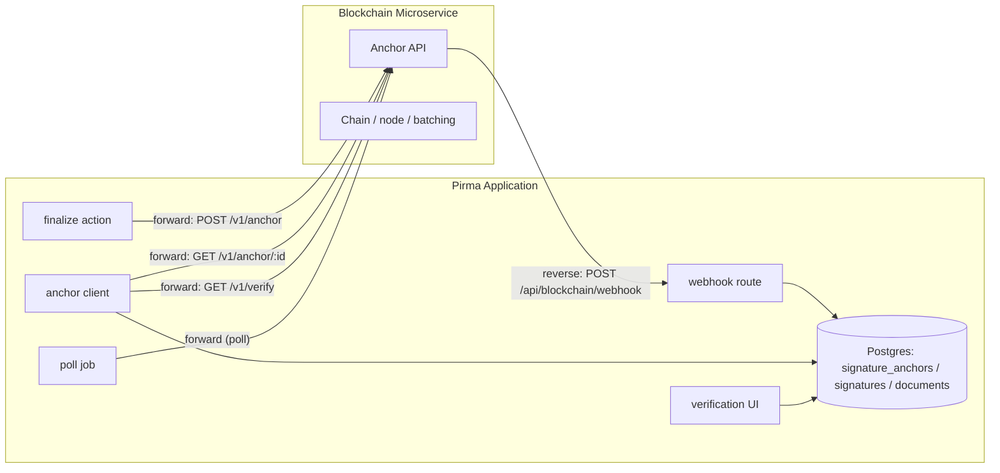
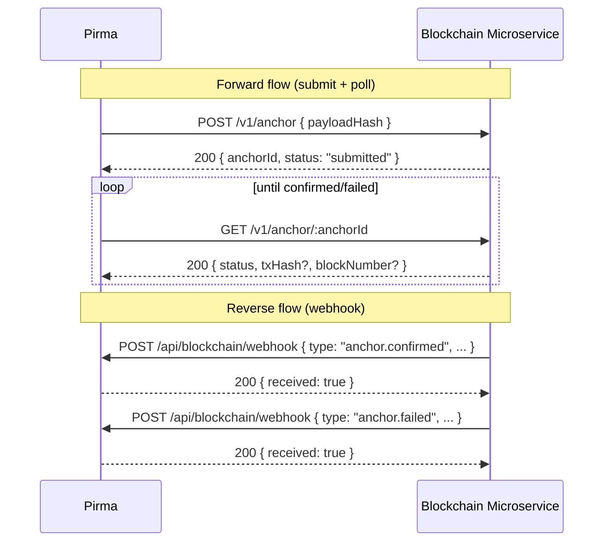

# Blockchain Microservice — API Overview

> Status: **Draft — for reference**
> Created: 2026-08-16
> Repo: `diego-yason/pirma`
> Related:
>
> - `docs/ai/blockchain-microservice/api-contract.md` — the full HTTP contract (this doc links to it)
> - `docs/ai/blockchain-integration.md` — broader internal integration spec (state machine, data model, payload hash)
> - `src/lib/server/db/schema.ts` (`signatures`, `documents`)

## Purpose

Pirma is a thin client over an external **blockchain microservice**. Pirma never runs a node or
writes to a chain directly. It:

1. Computes a deterministic `payloadHash` per document.
2. Submits it to the microservice for anchoring.
3. Learns the outcome via the **forward flow** (poll) and/or the **reverse flow** (webhook).
4. Stores the proof locally and flips `signatures.status` `signed → anchored`.
5. Exposes public verification.

On-chain data is **hashes only** — never document content, signature images, or PII.

## Architecture



## The two flows

### Forward flow — Pirma → microservice

Pirma drives anchoring and queries proof status:

| Direction | Method / Path                  | Purpose                                 |
| --------- | ------------------------------ | --------------------------------------- |
| →         | `POST /v1/anchor`              | Submit a `payloadHash` for anchoring    |
| →         | `POST /v1/anchor/batch`        | Batch-submit multiple hashes (optional) |
| →         | `GET /v1/anchor/:anchorId`     | Poll status of one anchor               |
| →         | `GET /v1/verify?payloadHash=…` | Public proof check (cross-check)        |
| →         | `GET /v1/health`               | Liveness/readiness probe                |

### Reverse flow — microservice → Pirma

The microservice pushes state changes back to Pirma via a webhook Pirma exposes:

| Direction | Method / Path                  | Purpose                                                                     |
| --------- | ------------------------------ | --------------------------------------------------------------------------- |
| ←         | `POST /api/blockchain/webhook` | Pirma's endpoint that receives anchor events                                |
| ←         | `GET /api/blockchain/health`   | (optional) lets the service check Pirma is alive before calling the webhook |

The reverse flow is **at-least-once, best-effort delivery**. Pirma treats it as an
optimization/notification layer; the **source of truth is always the forward `GET
/v1/anchor/:anchorId` poll**. Pirma's confirmation job reconciles either way, so missed or
duplicated webhooks are harmless.



## Conventions used by both sides

- **Base URL** for Pirma → service calls: `BLOCKCHAIN_API_URL` (env).
- **Versioning**: all service endpoints prefixed with `/v1`.
- **Auth (Pirma → service)**: `Authorization: Bearer <BLOCKCHAIN_API_KEY>`.
- **Auth (service → Pirma)**: HMAC-SHA256 signature header on the webhook (see
  `api-contract.md` §Reverse flow).
- **Status enum** (shared): `submitted | pending | confirmed | failed`.
- **Anchor key**: `payloadHash` is the idempotency key; re-submitting the same hash returns the
  same `anchorId`.
- **JSON everywhere**; ISO-8601 UTC timestamps; `null` for unknown optional fields.

## Configuration (Pirma side)

```
BLOCKCHAIN_API_URL=
BLOCKCHAIN_API_KEY=
BLOCKCHAIN_CHAIN=
BLOCKCHAIN_CONFIRMATIONS=
BLOCKCHAIN_TIMEOUT_MS=
BLOCKCHAIN_MAX_RETRIES=
BLOCKCHAIN_WEBHOOK_SECRET=
BLOCKCHAIN_ANCHOR_ON_FINALIZE=true
```

## Full contract

See **[`api-contract.md`](./api-contract.md)** for request/response schemas, examples, error
codes, idempotency, and security details for every endpoint in both flows.

## Open decisions (see also `docs/ai/blockchain-integration.md` §12)

1. Anchor granularity — per document (recommended) vs. per signature.
2. Auto-anchor after last signer vs. manual owner trigger.
3. Confirmation mechanism — poll, webhook, or both (both recommended).
4. Chain & cost — affects batching strategy (`POST /v1/anchor/batch`).
5. Proof retention — always store `proofJson` for offline verification.
6. Service idempotency — confirm re-submit returns the existing `anchorId`.
