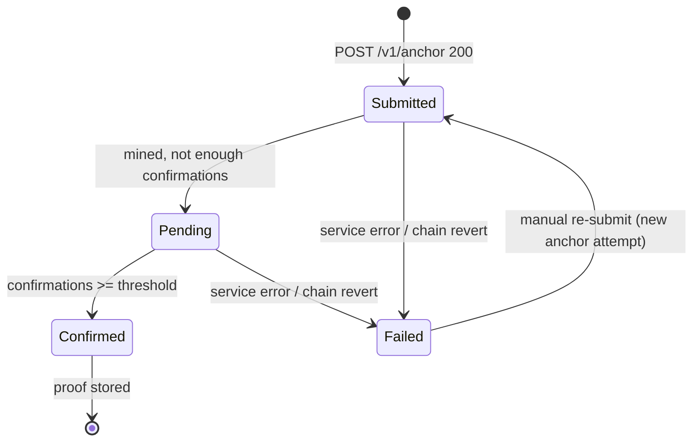

# Blockchain Microservice — API Contract

> Status: **Draft — for reference**
> Created: 2026-08-16
> Scope: the external HTTP surface between the Pirma application and the blockchain
> microservice, **in both directions** (Pirma → service = forward; service → Pirma = reverse).
>
> This document is the contract. It is versioned with the shared types in
> `src/lib/shared/blockchain.ts` (TBD) and should be reviewed with the service owner before
> implementation.

---

## 1. Conventions

- **Encoding**: JSON (`application/json`), UTF-8.
- **Timestamps**: ISO-8601 UTC, e.g. `2026-08-15T12:00:00Z`. Nullable where unknown.
- **IDs**:
    - `payloadHash` — hex SHA-256, lowercase. The anchor's idempotency key.
    - `anchorId` — service-owned opaque string, e.g. `svc_abc123`.
    - `eventId` — webhook event id (UUID), used for deduplication.
- **Status enum** (shared): `submitted | pending | confirmed | failed`.
- **Field rule**: unknown optional fields serialize as `null`, never omitted unless required.
- **Versioning**: service endpoints are prefixed `/v1`. Pirma's webhook path is
  `/api/blockchain/webhook`.

### 1.1 Shared types (single source of truth)

```ts
// src/lib/shared/blockchain.ts (proposed)
export type AnchorStatus = "submitted" | "pending" | "confirmed" | "failed";

export interface AnchorRecord {
    anchorId: string;
    payloadHash: string; // hex sha256
    txHash: string | null; // set when mined, null until then
    status: AnchorStatus;
    chain: string | null;
    blockNumber: number | null;
    blockHash: string | null;
    confirmations: number | null;
    timestamp: string | null; // block timestamp (ISO-8601 UTC)
    error: string | null; // human-readable reason when status = "failed"
}
```

---

## 2. Forward flow — Pirma → Blockchain Microservice

Auth on every request: `Authorization: Bearer <BLOCKCHAIN_API_KEY>`.

### 2.1 `POST /v1/anchor` — submit a hash

Submit a `payloadHash` for anchoring. Idempotent by `payloadHash`: re-submitting the same hash
returns the existing anchor (same `anchorId`, current status) instead of creating a duplicate.

**Request**

```jsonc
{
    "payloadHash": "9f86d081884c7d659a2feaa0c55ad015a3bf4f1b2b0b822cd15d6c15b0f00a08",
    "chain": "ethereum-l2", // optional — override the service default
    "confirmations": 12, // optional — override the service default
    "metadata": { "documentId": "uuid" }, // optional, service-agnostic; stored with the anchor
}
```

**Response `200`** (created or existing — same shape)

```jsonc
{
    "anchorId": "svc_abc123",
    "payloadHash": "9f86…a08",
    "txHash": null,
    "status": "submitted", // "submitted" | "pending" | "confirmed" | "failed"
    "chain": "ethereum-l2",
    "blockNumber": null,
    "blockHash": null,
    "confirmations": null,
    "timestamp": null,
    "error": null,
}
```

**Errors**

| Code  | Meaning                                                                                                                                 |
| ----- | --------------------------------------------------------------------------------------------------------------------------------------- |
| `400` | Malformed body, bad `payloadHash` (not 64-hex), unsupported `chain`. Body: `{ "error": { "code": "invalid_request", "message": "…" } }` |
| `401` | Missing/invalid API key                                                                                                                 |
| `402` | Insufficient funds/quota (if the service charges per anchor)                                                                            |
| `409` | (only if the service disallows re-submit) hash already anchored — prefer idempotent `200`                                               |
| `429` | Rate limited. Retry-After header                                                                                                        |
| `5xx` | Service error                                                                                                                           |

**Pirma behavior**

- Treat `200` with `status: "submitted" | "pending"` as **success**; never retry on those.
- Retry only on transport errors, `401`, `429`, `5xx` (exponential backoff,
  `BLOCKCHAIN_MAX_RETRIES` default 3, timeout `BLOCKCHAIN_TIMEOUT_MS` default 10s).
- `metadata.documentId` lets the service correlate; Pirma also stores the mapping locally in
  `signature_anchors`.

### 2.2 `POST /v1/anchor/batch` — batch submit (optional)

Used when the service is costly per anchor and Pirma wants to anchor several documents at once.

**Request**

```jsonc
{
    "payloadHashes": ["9f86…", "a2fe…"],
    "chain": "ethereum-l2", // optional
}
```

**Response `200`**

```jsonc
{
    "results": [
        { "payloadHash": "9f86…", "anchorId": "svc_abc123", "status": "submitted", "error": null },
        { "payloadHash": "a2fe…", "anchorId": "svc_def456", "status": "submitted", "error": null },
    ],
}
```

Partial failures are reported per item (`error` non-null, `anchorId` null) — not as an HTTP
error.

### 2.3 `GET /v1/anchor/:anchorId` — poll status

Pirma's source of truth for anchor state.

**Response `200`** — an `AnchorRecord`:

```jsonc
{
    "anchorId": "svc_abc123",
    "payloadHash": "9f86…a08",
    "txHash": "0x8c1d…",
    "status": "confirmed",
    "chain": "ethereum-l2",
    "blockNumber": 18234567,
    "blockHash": "0x3f9a…",
    "confirmations": 12,
    "timestamp": "2026-08-15T12:00:00Z",
    "error": null,
}
```

**Errors**

| Code  | Meaning            |
| ----- | ------------------ |
| `404` | Unknown `anchorId` |
| `401` | Invalid API key    |
| `5xx` | Service error      |

**Pirma behavior**

- A polling job selects local rows with `status in ('submitted','pending')` and advances them.
- `confirmed` → finalize proof locally. `failed` → record `lastError`, keep `signatures.status
= 'signed'`, surface to owner, allow manual re-submit.

### 2.4 `GET /v1/verify` — public proof check

Cross-check a hash or anchor against the chain. Used by Pirma's verification UI/API.

**Query**

- `?payloadHash=9f86…a08` **or**
- `?anchorId=svc_abc123`

**Response `200`**

```jsonc
{
    "anchored": true,
    "payloadHash": "9f86…a08",
    "txHash": "0x8c1d…",
    "blockNumber": 18234567,
    "timestamp": "2026-08-15T12:00:00Z",
}
```

`anchored: false` when the hash is not on chain (still `200`).

### 2.5 `GET /v1/health` — liveness/readiness

**Response `200`**

```jsonc
{ "status": "ok", "chain": "ethereum-l2", "blockNumber": 18234560 }
```

Pirma health-checks this before enabling the "Send to blockchain" action and to decide whether
to switch webhook-only to poll-only mode.

---

## 3. Reverse flow — Blockchain Microservice → Pirma

The microservice pushes anchor state changes to Pirma so Pirma does not have to poll for every
transition. **Delivery is at-least-once and best-effort** — Pirma must be idempotent, and the
forward `GET /v1/anchor/:anchorId` poll remains the fallback source of truth.

### 3.1 `POST /api/blockchain/webhook` — anchor events (Pirma's endpoint)

Called by the microservice when an anchor transitions to `confirmed` or `failed`. Pirma exposes
this route; the service must know it (via configuration/registration).

**Request headers**

| Header                   | Value                                                                 |
| ------------------------ | --------------------------------------------------------------------- |
| `Content-Type`           | `application/json`                                                    |
| `X-Blockchain-Event-Id`  | unique event id (UUID) — for deduplication                            |
| `X-Blockchain-Signature` | HMAC-SHA256 hex of the raw body, keyed by `BLOCKCHAIN_WEBHOOK_SECRET` |
| `X-Blockchain-Timestamp` | ISO-8601 UTC time the event was sent (replay window check)            |

**Request body**

```jsonc
{
    "type": "anchor.confirmed", // "anchor.confirmed" | "anchor.failed"
    "anchorId": "svc_abc123",
    "payloadHash": "9f86…a08",
    "occurredAt": "2026-08-15T12:00:05Z",
    "data": {
        "txHash": "0x8c1d…",
        "blockNumber": 18234567,
        "blockHash": "0x3f9a…",
        "confirmations": 12,
        "timestamp": "2026-08-15T12:00:00Z",
    },
    "error": null, // set only when type = "anchor.failed"
}
```

**Response `200`** — Pirma acknowledges. The body is informational.

```jsonc
{ "received": true, "eventId": "6f1a…" }
```

**Errors (Pirma → service)**

| Code  | Meaning                                                                            |
| ----- | ---------------------------------------------------------------------------------- |
| `400` | Malformed body / unknown `type`                                                    |
| `401` | Bad HMAC signature or stale timestamp                                              |
| `409` | Event already processed (optional; `200` is also acceptable for idempotent replay) |
| `5xx` | Pirma failed to persist — service should retry                                     |

**Delivery semantics (service side)**

- **At-least-once**: a webhook may be delivered more than once (network retries, replay). Pirma
  dedupes by `X-Blockchain-Event-Id`.
- **Retries**: on non-`2xx`, retry with exponential backoff (e.g. 1m → 5m → 30m), stop after a
  max (e.g. 8 attempts), then rely on Pirma's polling job to reconcile.
- **Ordering**: not guaranteed across anchors; each event is self-contained.
- **Fire-and-forget confirmation**: treat `2xx` as acked.

**Pirma behavior (webhook handler)**

1. Verify HMAC-SHA256 of the raw body against `BLOCKCHAIN_WEBHOOK_SECRET` → else `401`.
2. Reject if `X-Blockchain-Timestamp` is outside a window (e.g. ±5 min) → replay protection.
3. Look up the anchor by `anchorId` (or `payloadHash`); if unknown → `404`/`400` so the service
   does not silently drop it.
4. If `X-Blockchain-Event-Id` already processed → return `200` without side effects.
5. Apply the transition (see §4 state transitions).
6. Return `200`.

### 3.2 `GET /api/blockchain/health` — (optional) Pirma's health endpoint

Lets the service verify Pirma is reachable before sending a webhook (e.g. after a long retry
backoff). No auth required; returns the service's last-known-good status from Pirma's DB.

**Response `200`**

```jsonc
{ "status": "ok", "service": "pirma", "lastAnchorReceivedAt": "2026-08-15T12:00:05Z" }
```

---

## 4. State transitions (applied by the reverse flow or the polling job)



Local effects in Pirma when an anchor reaches **confirmed**:

1. Update `signature_anchors` with tx/block/proof fields and `confirmedAt`.
2. `UPDATE signatures SET status = 'anchored' WHERE document_id = ? AND status = 'signed'`.
3. If all signers for the document are anchored → `UPDATE documents SET status = 'executed'`.

Local effects when an anchor **fails**:

1. Update `signature_anchors` with `lastError`, `attempts + 1`.
2. `signatures.status` stays `signed` (signing is unaffected by anchoring failure).
3. Surface a "needs anchoring" banner to the document owner + manual re-submit.

---

## 5. Idempotency & retries

| Concern            | Forward (Pirma → service)                                   | Reverse (service → Pirma)                  |
| ------------------ | ----------------------------------------------------------- | ------------------------------------------ |
| Key                | `payloadHash`                                               | `X-Blockchain-Event-Id`                    |
| Re-submit behavior | Returns existing anchor (same `anchorId`)                   | Returns `200`, no side effects             |
| Retried by         | Pirma's `anchor-client` (backoff, `BLOCKCHAIN_MAX_RETRIES`) | Service (backoff up to max attempts)       |
| Fallback           | —                                                           | Pirma polling job reconciles missed events |

Pirma must never double-submit the same `payloadHash`; it checks `signature_anchors` for an
existing row first (unique constraint on `payload_hash`).

---

## 6. Security

- **Pirma → service**: HTTPS + `Bearer` API key (`BLOCKCHAIN_API_KEY`, server-side env only —
  never in client code).
- **Service → Pirma**: HMAC-SHA256 over the raw request body, hex-encoded in
  `X-Blockchain-Signature`, keyed by `BLOCKCHAIN_WEBHOOK_SECRET` (random, ≥32 bytes, unique to
  this pairing). Pirma verifies every webhook.
- **Replay protection**: `X-Blockchain-Timestamp` within ±5 min + event-id dedup table.
- **Data minimization**: only `payloadHash` + optional metadata crosses the boundary; no
  document content, signature images, names, or emails.
- **Failure isolation**: a failed anchor never reverts a valid signature.
- **Logging**: tag all service calls `blockchain`; log `anchorId`, `payloadHash`,
  `documentId`, status transitions, and webhook verifications.

---

## 7. Contract decisions to confirm with the service owner

1. **Idempotency**: re-submitting the same `payloadHash` → same `anchorId`? (assumed yes).
2. **Chains** supported and the default.
3. **Confirmations threshold** (finality) — default and per-request override.
4. **Rate limits / cost** per anchor — determines batching strategy.
5. **Availability/SLA** and whether proofs can be replayed after downtime (vs. Pirma storing
   `proofJson` for offline verification).
6. **Webhook registration** — how the service learns Pirma's webhook URL + secret
   (config/UI/onboarding).
7. **Batch semantics** — max batch size, partial-failure handling (assumed per-item).
8. **Retry policy** for webhook delivery — intervals and max attempts (assumed 1m→5m→30m, 8).
9. **Event types** — only `confirmed`/`failed`? Any `pending`/`submitted` notifications useful?
10. **Proof payload** — does the service return a Merkle path/receipt (`proofJson`) for offline
    verification?

## 8. Related work

- Implementation checklist: `docs/ai/blockchain/blockchain-integration.md` §13.
- Payload hash spec: `docs/ai/blockchain/blockchain-integration.md` §8.
- Anchor client + `signature_anchors` model: `docs/ai/blockchain/blockchain-integration.md` §5–6.
