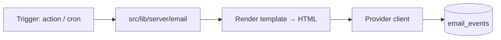

# Email & Notifications (the signing loop)

> Status: **Implemented (2026-08-16)** — all 7 emails in the initial set are built and wired
> (invite, signed, rejected, executed, reminders, password reset, guest OTP). Reminders need an
> external scheduler to hit `POST /api/cron/reminders` (secret-protected). Created: 2026-08-16
> Repo: `diego-yason/pirma`
> Related:
> - `docs/ai/roadmap.md` §5 (signer email invitations, owner notifications)
> - `docs/ai/guest-tokens.md` (token → signing URL; OTP path)
> - `docs/ai/pdfa/document-flows.md` (certificates / audit pages)
> - `src/routes/(app)/doc/new/[packageId]/confirm/+page.server.ts` (TODO: send email)
> - `src/routes/(app)/doc/[pageId]/sign/+page.server.ts` (`finalize`, `reject`)

## Purpose

A transactional email foundation that makes the signing loop actually work end to end.
Today the app generates signing URLs + guest tokens but **never emails anyone**, and there is
no notification path to the owner. This doc covers the email side only; the **in-app
notification / activity feed** is a separate future item (roadmap §8.3 / §6).

## Emails (initial set)

| # | Email | Trigger | To | Notes | Status |
|---|---|---|---|---|---|
| 1 | **Signer invite** | Package created / recipient added (`confirm` action) | Recipient | Contains signing URL (guest token for non-users, direct link for users), package name, deadline | ✅ |
| 2 | **Signed** | `finalize` stores a signature | Owner | "`{signer}` signed `{document}`" | ✅ |
| 3 | **Rejected** | `reject` action | Owner | Includes the rejection reason | ✅ |
| 4 | **Executed summary** | All signers done → `executed` | Owner (+ signers) | Links to the executed document / certificate | ✅ |
| 5 | **Reminder** | Scheduled nudge (e.g. day 3, day 7) | Outstanding signers | Reuses the invite link | ✅ |
| 6 | **Password reset** | "Forgot password?" (`requestPasswordReset`) | User | Standard Better Auth reset link | ✅ |
| 7 | **Guest OTP** | Per `guest-tokens.md` | Guest | Email OTP for sign-in | ✅ |

## Provider decision (default + open)

- **Recommended default: Resend** (simple API, good deliverability, no SMTP config).
- Alternatives: **Postmark**, **SendGrid**, or plain **SMTP** (self-hosted).
- Open decision: pick one; everything below is provider-agnostic behind a thin module.

## Architecture



### `src/lib/server/email/` module — ✅ implemented

- `sendEmail({ to, subject, html, text?, eventId, template })` — provider-agnostic send
  (`src/lib/server/email/index.ts`).
- `providers.ts` — thin adapters: **Resend** (REST via `fetch`, no dep) + **console**
  (logs instead of sending; default so dev works without a key). Selected by `EMAIL_PROVIDER`.
- `templates/` — function-based HTML renderers with a shared shell (`templates/shell.ts`):
  `signer-invite`, `signed`, `rejected`. Preview at `(dev)/email/request`.
- **Idempotency/logging**: `email_events` table (migration `0001`) — `eventId`, `to`,
  `template`, `status: queued|sent|failed`, `error`, `sentAt`; unique `eventId` so retries
  don't double-send, and an audit trail of who was contacted.

## Implementation status (2026-08-16)

- ✅ `src/lib/server/email/` module (send + console/Resend providers + templates).
- ✅ `email_events` table (Drizzle migration `0001_natural_the_executioner`).
- ✅ Env: `EMAIL_PROVIDER`, `EMAIL_FROM`, `RESEND_API_KEY` (`src/env.ts`, `.env.example`).
- ✅ #1 Signer invite — wired in `confirm/+page.server.ts` `finalize` (tokenized URL for guests,
  plain sign link for registered users).
- ✅ #2 Signed — wired in `sign/+page.server.ts` `finalize`.
- ✅ #3 Rejected — `reject` action now marks the recipient (`package_recipients.rejectedAt` /
  `rejectionReason`), flips existing signature rows to `rejected`, and notifies the owner.
- ✅ #4 Executed summary — `finalize` checks when every signer has signed every document, marks
  them `executed`, and emails the owner + signers.
- ✅ #5 Reminders — `src/lib/server/email/reminders.ts` (`sendDueReminders`) sends day 3/7 nudges
  (configurable via `EMAIL_REMIND_DAYS`, default `3,7`), idempotent per `reminder:{pkg}:{recipient}:{day}`.
  Triggered by `POST /api/cron/reminders` (requires `x-cron-secret` header == `CRON_SECRET`).
- ✅ #6 Password reset — Better Auth `sendResetPassword` hook wired; `/forgot-password` and
  `/reset-password` routes added; login "Forgot password?" now links to the flow.
- ✅ #7 Guest OTP — `guest_otps` table (migration `0002`), `createGuestOtp`/`verifyGuestOtp`,
  `/api/guest/otp/request` + `/api/guest/otp/verify`, and the sign page OTP gate.

### Wiring points

1. ✅ `doc/new/[packageId]/confirm/+page.server.ts` — invite sent after guest token + signing
   URL are generated.
2. ✅ `sign/+page.server.ts` `finalize` — owner notified after signatures are stored, then the
   "all signers done → `executed`" check marks documents executed and emails the summary.
3. ✅ `sign/+page.server.ts` `reject` — signatory verified, recipient marked rejected with
   reason, owner notified.
4. ✅ `login/+page.svelte` → `/forgot-password` → `/reset-password` — reset flow wired to
   `authClient.requestPasswordReset` / `authClient.resetPassword`.

### Reminders (roadmap §8.1)

- A scheduled job (e.g. `node:cron` or a serverless scheduled function) selects packages with
  outstanding signatures past a nudge threshold and sends **reminder** emails.
- Defaults: remind at **day 3 and day 7** after the invite; stop after the deadline.
- Open decision: make `packages.expirationDate` a **hard deadline** (blocks signing) vs. a
  soft warning.

## Security & deliverability

> See also: `docs/ai/security/email-security-review.md` (2026-08-16 review — token/code log leakage, reset
> token storage, OTP hashing, and rate limiting are the open items).

- Signing URLs + tokens only ever appear in email; never logged. ⚠️ *currently violated by the
  console provider + `confirm` logging (EMR-01).*
- Rate-limit reset/OTP/reminder sends per recipient to avoid abuse. ⚠️ *not yet implemented
  (EMR-04).*
- `EMAIL_FROM` should be a verified domain/sender for the provider.
- Respect a basic unsubscribe/notification preference (out of scope for v1 unless needed).

## Config

```
EMAIL_PROVIDER=resend            # resend | postmark | sendgrid | smtp
RESEND_API_KEY=                  # or provider-specific keys
EMAIL_FROM="Pirma <noreply@…>"
EMAIL_REMIND_DAYS=3,7            # reminder schedule
PUBLIC_ORIGIN=                   # base URL for signing links (matches app origin)
```

## Open decisions

1. **Provider** — Resend (recommended) vs Postmark/SendGrid/SMTP.
2. Template styling/branding (white-label) — reuse default for v1.
3. Reminder schedule + hard vs. soft deadline.
4. Whether to add a DB-backed `notifications` table now (for the future activity feed) or
   keep emails only for v1.
5. Email event retention (keep `email_events` forever vs. prune).

## Out of scope (this doc)

- In-app notification center / activity feed (roadmap §8.3).
- Full unsubscribe/preferences management.
- Bulk/marketing email.
