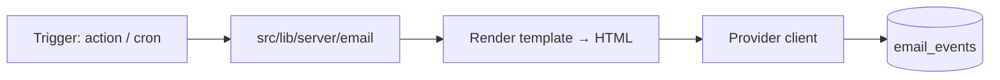

# Email & Notifications (the signing loop)

> Status: **Draft — design, not implemented**
> Created: 2026-08-16
> Repo: `diego-yason/pirma`
> Related:
> - `docs/ai/roadmap.md` §5 (signer email invitations, owner notifications)
> - `docs/ai/guest-tokens.md` (token → signing URL; OTP path)
> - `docs/ai/pdfa/document-flows.md` (certificates / audit pages)
> - `src/routes/(app)/doc/new/[packageId]/confirm/+page.server.ts` (TODO: send email)
> - `src/routes/(app)/doc/[pageId]/sign/+page.server.ts` (`finalize`, `reject`)

## Purpose

A transactional email foundation that makes the signing loop actually work end to end.
Today the app generates signing URLs + guest tokens but **never emails anyone**, and there is
no notification path to the owner. This doc covers the email side only; the **in-app
notification / activity feed** is a separate future item (roadmap §8.3 / §6).

## Emails (initial set)

| # | Email | Trigger | To | Notes |
|---|---|---|---|---|
| 1 | **Signer invite** | Package created / recipient added (`confirm` action) | Recipient | Contains signing URL (guest token for non-users, direct link for users), package name, deadline |
| 2 | **Signed** | `finalize` stores a signature | Owner | "`{signer}` signed `{document}`" |
| 3 | **Rejected** | `reject` action | Owner | Includes the rejection reason |
| 4 | **Executed summary** | All signers done → `executed` | Owner (+ signers) | Links to the executed document / certificate |
| 5 | **Reminder** | Scheduled nudge (e.g. day 3, day 7) | Outstanding signers | Reuses the invite link |
| 6 | **Password reset** | "Forgot password?" (`requestPasswordReset`) | User | Standard Better Auth reset link |
| 7 | **Guest OTP** (future) | Per `guest-tokens.md` | Guest | Email OTP for sign-in |

## Provider decision (default + open)

- **Recommended default: Resend** (simple API, good deliverability, no SMTP config).
- Alternatives: **Postmark**, **SendGrid**, or plain **SMTP** (self-hosted).
- Open decision: pick one; everything below is provider-agnostic behind a thin module.

## Architecture



### `src/lib/server/email/` module

- `sendEmail({ to, subject, html, text?, metadata? })` — provider-agnostic send.
- `templates/` — per-email HTML renderers (reuse the `(dev)/email/request` styling or a small
  `svelte-email`-style renderer). Simple function-based HTML first; no heavy framework.
- **Idempotency/logging**: insert an `email_events` row (`eventId`, `to`, `template`,
  `status: queued|sent|failed`, `error`, `sentAt`) keyed by a unique `eventId` so retries
  don't double-send, and so we have an audit trail of who was contacted.

### Wiring points (the current TODOs)

1. `doc/new/[packageId]/confirm/+page.server.ts` — after creating the guest token + signing
   URL, call `sendEmail` for the **invite** (replaces `// TODO: Send email…`).
2. `sign/+page.server.ts` `finalize` — after signatures are stored, notify the owner (and
   check whether all signers are done → `executed` summary).
3. `sign/+page.server.ts` `reject` — notify the owner with the reason.
4. `login/+page.svelte` — wire "Forgot password?" to `authClient.requestPasswordReset` +
   the email template.

### Reminders (roadmap §8.1)

- A scheduled job (e.g. `node:cron` or a serverless scheduled function) selects packages with
  outstanding signatures past a nudge threshold and sends **reminder** emails.
- Defaults: remind at **day 3 and day 7** after the invite; stop after the deadline.
- Open decision: make `packages.expirationDate` a **hard deadline** (blocks signing) vs. a
  soft warning.

## Security & deliverability

- Signing URLs + tokens only ever appear in email; never logged.
- Rate-limit reset/OTP/reminder sends per recipient to avoid abuse.
- `EMAIL_FROM` should be a verified domain/sender for the provider.
- Respect a basic unsubscribe/notification preference (out of scope for v1 unless needed).

## Config

```
EMAIL_PROVIDER=resend            # resend | postmark | sendgrid | smtp
RESEND_API_KEY=                  # or provider-specific keys
EMAIL_FROM="Pirma <noreply@…>"
EMAIL_REMIND_DAYS=3,7            # reminder schedule
PUBLIC_ORIGIN=                   # base URL for signing links (matches app origin)
```

## Open decisions

1. **Provider** — Resend (recommended) vs Postmark/SendGrid/SMTP.
2. Template styling/branding (white-label) — reuse default for v1.
3. Reminder schedule + hard vs. soft deadline.
4. Whether to add a DB-backed `notifications` table now (for the future activity feed) or
   keep emails only for v1.
5. Email event retention (keep `email_events` forever vs. prune).

## Out of scope (this doc)

- In-app notification center / activity feed (roadmap §8.3).
- Full unsubscribe/preferences management.
- Bulk/marketing email.
