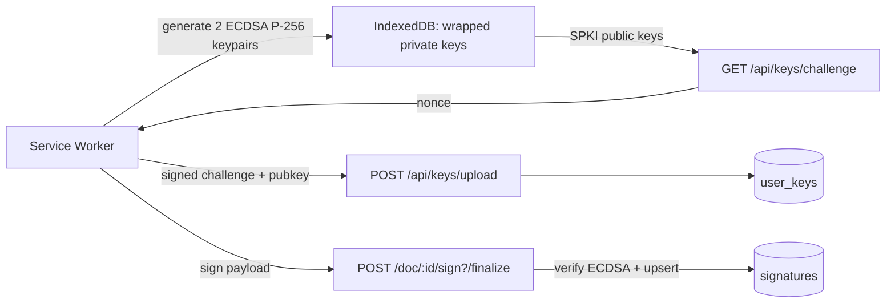

# Key Signing Architecture — Assessment & Recommendations

> Status: **Assessment**
> Created: 2026-08-16
> Scope: client key generation → key upload → document signing → verification → rotation

## Verdict

**Solid bones, unfinished and currently unsafe in a few specific spots.** The high-level
design is right, but there are two real security holes, several dead/vestigial pieces, and a
lot of `TODO`s that leave the promise of the architecture unfulfilled. Treat this as a
**promising prototype — do not ship as-is.**

## Current flow

## What's genuinely good

- **Keys never touch the server in plaintext.** ECDSA P-256 keypairs are generated in a
  service worker, private keys are wrapped (`wrapKey`), and the server only ever sees SPKI
  public keys.
- **Proof-of-possession on upload.** `/api/keys/challenge` → `/api/keys/upload` uses a
  one-time challenge signed with the private key before the public key is accepted.
- **Server re-verifies from server-side truth.** `finalize` recomputes the payload from
  `documents.hash` in the DB rather than trusting the client.
- **One signature per document, not per field.** The `buildSigningPayload` contract is clean
  and the client/server both honor it.
- **A rotation policy actually exists** (`src/lib/server/crypto/key-rotation.ts`) covering age,
  idle time, usage count, and algorithm allowlist.

## Critical issues (fix before shipping)

1. **`finalize` never checks the user is a signatory, and never checks field ownership.**
    - File: `src/routes/(app)/doc/[pageId]/sign/+page.server.ts`
    - The `load` function validates signatory membership, but the `finalize` action is
      independently reachable. `resolveParty` just returns `locals.user.id`, and `sigFieldDoc`
      is built from _all_ package fields with no check that a field's `assignedTo` matches the
      caller.
    - A logged-in user can submit a crafted request and record signatures against fields
      assigned to other signers.
    - **Fix:** verify `party.userId` is in `packageRecipients` as `signer`, and that every
      `signedFieldId` is assigned to them.

2. **Level-1 key "encryption" is not encryption.**
    - File: `src/service-worker/index.ts` (`handleGenerateKeyPair`)
    - `deriveKey(userId, userId)` uses the Better Auth user ID as both password and salt. User
      IDs are not secret (they appear in the DB, client state, and logs).
    - Anyone with access to IndexedDB can derive the same AES-GCM key and unwrap the private key.
    - **Fix:** level-1 keys must be unlocked with real user authentication (password/OPAQUE
      secret), or exist only as non-extractable, session-scoped keys.

3. **`kid` is ignored server-side and `keyLevel` is client-trusted.**
    - `finalize` sends `kid` and `keyLevel`, then the server looks up the key by
      `(userId, keyLevel)` with `.limit(1)` — `kid` is never used.
    - With multiple active keys per level, verification can hit an arbitrary key and fail.
    - Level-2 ("password-encrypted") signing is unimplemented: `loadKeys` skips level-2 keys and
      `handleSign` ignores the `keyLevel` argument. The two-tier key system is currently
      vestigial.

## High-priority gaps

4. **Rotation/revocation is not enforced at signing time.** `finalize` never calls
   `checkKeyRotation`, and `revokedAt` is never set anywhere — there is no revocation endpoint.
   The rotation policy only _warns_ at login; an overused/expired key can still sign.

5. **Guest signing is built on a throwaway secret.**
    - File: `src/routes/(app)/doc/[pageId]/sign/+page.svelte` (`setupGuestSession`)
    - `guestKeySecret = crypto.randomUUID()` lives only in memory, and `setupDeviceKeys(...,
force: true)` regenerates + re-uploads keys on every visit, leaving orphaned key rows.
    - Guest signing only "works" by falling back to the insecure level-1 key.

6. **Two competing postMessage RPC implementations with colliding IDs.**
    - Files: `src/lib/client/crypto/sw-key.ts` and `src/lib/client/crypto/setup-device-keys.ts`
    - Both register `serviceWorker` message listeners and both allocate IDs via `k${++nextId}`.
      Collisions are possible and the wrong module can resolve the other's promise.
    - **Fix:** consolidate into one RPC layer.

7. **Challenge nonces are an in-memory `Map`.**
    - File: `src/lib/server/crypto/key-challenge.ts`
    - Breaks across server restarts and multi-instance deployments; no rate limiting on
      `/api/keys/challenge`.

## Medium issues

8. **No re-verification or public verification path.** `verify-signature.ts` is only used at
   `finalize` and `upload`; the `view` page trusts `signatures.status` from the DB. `anchored`
   is never set (see `docs/ai/blockchain-integration.md`), and there is no endpoint for a third
   party to check a signature against a pubkey.

9. **Signing payload is too weak.** `${docHash}:${fieldCount}` does not bind the field IDs,
   package, signatory, or algorithm version. Two different field sets with the same count
   produce the same payload. **Fix:** fold in the sorted field IDs (or a hash of them).

10. **Sequential signing is client-only.** `canSign = false` for later groups is a UI stub;
    `finalize` does not enforce signing order server-side.

11. **The `reject` action is a stub** (all logic is `TODO`), and `executed` status is a `TODO`.

12. **Dead code / parallel key systems.** `src/lib/client/archive/crypto.ts`,
    `src/lib/client/archive/webauthn.ts`, and the `keyType === "webauthn"` branch in
    `/api/keys/register` are archived but still present alongside the SW system. Remove to
    avoid confusion.

13. **`setupDeviceKeys` early-returns `2`** when keys exist locally, without confirming the
    server still has them — so a revoked/deleted server key is invisible to the client.

## Recommended order of work

1. **Server-side authorization in `finalize`** — signatory membership + field ownership checks
   (critical).
2. **Fix level-1 key protection** — stop deriving keys from `userId` alone (critical).
3. **Bind `kid` to verification and implement level-2 signing**, or remove the second tier until
   it is real.
4. **Enforce rotation/revocation at signing time + add a revoke endpoint.**
5. **Consolidate the SW RPC layer** (single message handler, unique IDs).
6. **Persist challenges** (DB/Redis) and add rate limiting.
7. **Strengthen the signing payload** (include field IDs / package / version).
8. **Add a verification endpoint** and wire up `anchored`/`executed` per the blockchain spec.
9. **Delete the archived key system** and the dead WebAuthn branch.

## Decision & implementation (2026-08-16)

**Chosen: level-1 = session-only ephemeral keys for everyone; level-2 = persistent
password-bound keys kept (recommendation option a).** Extra key rows are acceptable.

### What was implemented

| Area              | Change                                                                                                                                                                                                                                                                |
| ----------------- | --------------------------------------------------------------------------------------------------------------------------------------------------------------------------------------------------------------------------------------------------------------------- |
| Service worker    | Level-1 keys are non-extractable (`extractable: false`, `["sign"]` only), held in the in-memory `keyStore`, **never written to IndexedDB**. Level-2 keys are wrapped with `PBKDF2(password, random per-key salt)` and persisted with the salt.                        |
| SW messages       | `hasKeys` now checks in-memory session keys; new `hasPersistentKeys` checks IndexedDB for level-2. `loadKeys` unwraps level-2 only when a password is provided.                                                                                                       |
| Client setup      | `setupDeviceKeys(userId, password?, force?)` — password-less calls produce only the level-1 session key; level-2 is created only when a password is present and missing. "Always upload what the SW generated" keeps local + server state in sync (no orphaned keys). |
| Guest/anonymous   | Level-1 session key only; the throwaway `guestKeySecret` flow is removed.                                                                                                                                                                                             |
| Server upload     | Revokes prior active **same-level** keys for the user (retains rows, never deletes) inside a transaction.                                                                                                                                                             |
| Server `finalize` | Looks up the key by `kid` (owned by user + not revoked) instead of `(userId, keyLevel)` + `.limit(1)`, and validates the requested `keyLevel` matches.                                                                                                                |
| Sign page         | Lazily generates a level-1 session key if the SW lost it; if the server rejects the key as revoked, regenerates and retries once.                                                                                                                                     |

### Known tradeoffs / notes

- Old session keys are revoked when a newer level-1 key is uploaded (last login wins). A stale
  open session's key becomes unusable server-side — the sign page regenerates automatically.
- Legacy IndexedDB records (userId-derived, no `salt`) are intentionally ignored by `loadKeys`.
- This addresses critical issues **#2** and **#3** and high-priority gap **#5**.
- Still open: **#1** (signatory/field authorization in `finalize`), **#4** (enforce rotation at
  signing + revoke endpoint), **#6** (RPC consolidation), **#7** (persistent challenges),
  **#8**–**#13**.
