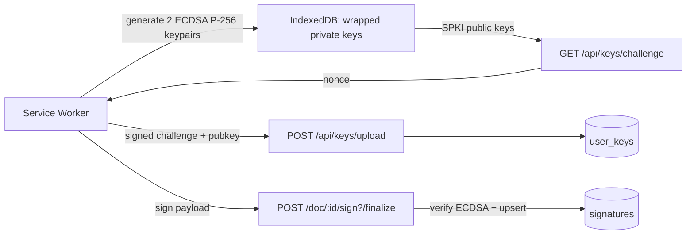

# Key Signing Architecture — Assessment & Recommendations

> Status: **Assessment**
> Created: 2026-08-16
> Scope: client key generation → key upload → document signing → verification → rotation
> Payload spec: see `docs/ai/keys/payloads.md` (T1/T2/T3 signed + upload payloads, 2026-08-22).

## Verdict

**Solid bones, unfinished and currently unsafe in a few specific spots.** The high-level
design is right, but there are two real security holes, several dead/vestigial pieces, and a
lot of `TODO`s that leave the promise of the architecture unfulfilled. Treat this as a
**promising prototype — do not ship as-is.**

## Current flow

## What's genuinely good

- **Keys never touch the server in plaintext.** ECDSA P-256 keypairs are generated in a
  service worker, private keys are wrapped (`wrapKey`), and the server only ever sees SPKI
  public keys.
- **Proof-of-possession on upload.** `/api/keys/challenge` → `/api/keys/upload` uses a
  one-time challenge signed with the private key before the public key is accepted.
- **Server re-verifies from server-side truth.** `finalize` recomputes the payload from
  `documents.hash` in the DB rather than trusting the client.
- **One signature per document, not per field.** The `buildSigningPayload` contract is clean
  and the client/server both honor it.
- **A rotation policy actually exists** (`src/lib/server/crypto/key-rotation.ts`) covering age,
  idle time, usage count, and algorithm allowlist.

## Critical issues (fix before shipping)

1. **`finalize` never checks the user is a signatory, and never checks field ownership.**
    - File: `src/routes/(app)/doc/[pageId]/sign/+page.server.ts`
    - The `load` function validates signatory membership, but the `finalize` action is
      independently reachable. `resolveParty` just returns `locals.user.id`, and `sigFieldDoc`
      is built from _all_ package fields with no check that a field's `assignedTo` matches the
      caller.
    - A logged-in user can submit a crafted request and record signatures against fields
      assigned to other signers.
    - **Fix:** verify `party.userId` is in `packageRecipients` as `signer`, and that every
      `signedFieldId` is assigned to them.

2. **Level-1 key "encryption" is not encryption.**
    - File: `src/service-worker/index.ts` (`handleGenerateKeyPair`)
    - `deriveKey(userId, userId)` uses the Better Auth user ID as both password and salt. User
      IDs are not secret (they appear in the DB, client state, and logs).
    - Anyone with access to IndexedDB can derive the same AES-GCM key and unwrap the private key.
    - **Fix:** level-1 keys must be unlocked with real user authentication (password/OPAQUE
      secret), or exist only as non-extractable, session-scoped keys.

3. **`kid` is ignored server-side and `keyLevel` is client-trusted.**
    - `finalize` sends `kid` and `keyLevel`, then the server looks up the key by
      `(userId, keyLevel)` with `.limit(1)` — `kid` is never used.
    - With multiple active keys per level, verification can hit an arbitrary key and fail.
    - Level-2 ("password-encrypted") signing is unimplemented: `loadKeys` skips level-2 keys and
      `handleSign` ignores the `keyLevel` argument. The two-tier key system is currently
      vestigial.

## High-priority gaps

4. **Rotation/revocation is not enforced at signing time.** `finalize` never calls
   `checkKeyRotation`, and `revokedAt` is never set anywhere — there is no revocation endpoint.
   The rotation policy only _warns_ at login; an overused/expired key can still sign.

5. **Guest signing is built on a throwaway secret.**
    - File: `src/routes/(app)/doc/[pageId]/sign/+page.svelte` (`setupGuestSession`)
    - `guestKeySecret = crypto.randomUUID()` lives only in memory, and `setupDeviceKeys(...,
force: true)` regenerates + re-uploads keys on every visit, leaving orphaned key rows.
    - Guest signing only "works" by falling back to the insecure level-1 key.

6. **Two competing postMessage RPC implementations with colliding IDs.**
    - Files: `src/lib/client/crypto/sw-key.ts` and `src/lib/client/crypto/setup-device-keys.ts`
    - Both register `serviceWorker` message listeners and both allocate IDs via `k${++nextId}`.
      Collisions are possible and the wrong module can resolve the other's promise.
    - **Fix:** consolidate into one RPC layer.

7. **Challenge nonces are an in-memory `Map`.**
    - File: `src/lib/server/crypto/key-challenge.ts`
    - Breaks across server restarts and multi-instance deployments; no rate limiting on
      `/api/keys/challenge`.

## Medium issues

8. **No re-verification or public verification path.** `verify-signature.ts` is only used at
   `finalize` and `upload`; the `view` page trusts `signatures.status` from the DB. `anchored`
   is never set (see `docs/ai/blockchain/blockchain-integration.md`), and there is no endpoint for a third
   party to check a signature against a pubkey.

9. **Signing payload is too weak.** `${docHash}:${fieldCount}` does not bind the field IDs,
   package, signatory, or algorithm version. Two different field sets with the same count
   produce the same payload. **Fix:** fold in the sorted field IDs (or a hash of them).

10. **Sequential signing is client-only.** `canSign = false` for later groups is a UI stub;
    `finalize` does not enforce signing order server-side.

11. **The `reject` action is a stub** (all logic is `TODO`), and `executed` status is a `TODO`.

12. **Dead code / parallel key systems.** `src/lib/client/archive/crypto.ts`,
    `src/lib/client/archive/webauthn.ts`, and the `keyType === "webauthn"` branch in
    `/api/keys/register` are archived but still present alongside the SW system. Remove to
    avoid confusion.

13. **`setupDeviceKeys` early-returns `2`** when keys exist locally, without confirming the
    server still has them — so a revoked/deleted server key is invisible to the client.

## Recommended order of work

1. **Server-side authorization in `finalize`** — signatory membership + field ownership checks
   (critical).
2. **Fix level-1 key protection** — stop deriving keys from `userId` alone (critical).
3. **Bind `kid` to verification and implement level-2 signing**, or remove the second tier until
   it is real.
4. **Enforce rotation/revocation at signing time + add a revoke endpoint.**
5. **Consolidate the SW RPC layer** (single message handler, unique IDs).
6. **Persist challenges** (DB/Redis) and add rate limiting.
7. **Strengthen the signing payload** (include field IDs / package / version) — ✅ done for the
   interim payload, but **Option B (2026-08-23) retires it**: the compliance end-state is a
   **PAdES-compliant** signature (embedded PAdES-BASELINE-T in the PDF/A artifact, replacing the
   custom text payload — no detached ECDSA; see `docs/ai/pdfa/pades-baseline-t-spec.md`).
8. **Add a verification endpoint** and wire up `anchored`/`executed` per the blockchain spec.
9. **Delete the archived key system** and the dead WebAuthn branch.

## Decision & implementation (2026-08-16)

**Chosen: level-1 = session-only ephemeral keys for everyone; level-2 = persistent
password-bound keys kept (recommendation option a).** Extra key rows are acceptable.

### What was implemented

| Area              | Change                                                                                                                                                                                                                                                                |
| ----------------- | --------------------------------------------------------------------------------------------------------------------------------------------------------------------------------------------------------------------------------------------------------------------- |
| Service worker    | Level-1 keys are non-extractable (`extractable: false`, `["sign"]` only), held in the in-memory `keyStore`, **never written to IndexedDB**. Level-2 keys are wrapped with `PBKDF2(password, random per-key salt)` and persisted with the salt.                        |
| SW messages       | `hasKeys` now checks in-memory session keys; new `hasPersistentKeys` checks IndexedDB for level-2. `loadKeys` unwraps level-2 only when a password is provided.                                                                                                       |
| Client setup      | `setupDeviceKeys(userId, password?, force?)` — password-less calls produce only the level-1 session key; level-2 is created only when a password is present and missing. "Always upload what the SW generated" keeps local + server state in sync (no orphaned keys). |
| Guest/anonymous   | Level-1 session key only; the throwaway `guestKeySecret` flow is removed.                                                                                                                                                                                             |
| Server upload     | Revokes prior active **same-level** keys for the user (retains rows, never deletes) inside a transaction.                                                                                                                                                             |
| Server `finalize` | Looks up the key by `kid` (owned by user + not revoked) instead of `(userId, keyLevel)` + `.limit(1)`, and validates the requested `keyLevel` matches.                                                                                                                |
| Sign page         | Lazily generates a level-1 session key if the SW lost it; if the server rejects the key as revoked, regenerates and retries once.                                                                                                                                     |

### Known tradeoffs / notes

- Old session keys are revoked when a newer level-1 key is uploaded (last login wins). A stale
  open session's key becomes unusable server-side — the sign page regenerates automatically.
- Legacy IndexedDB records (userId-derived, no `salt`) are intentionally ignored by `loadKeys`.
- This addresses critical issues **#2** and **#3** and high-priority gap **#5**.
- Still open: **#1** (signatory/field authorization in `finalize`), **#4** (enforce rotation at
  signing + revoke endpoint), **#6** (RPC consolidation), **#7** (persistent challenges),
  **#8**–**#13**.

## Tier model revision (2026-08-22)

> Design intent — reflects the decision that **key tier (1 vs 2) cannot be trusted from
> client-supplied metadata alone** (KSR-03). Tier is therefore derived from *how* the key is
> handled rather than a self-declared flag.

### 1. Tier-1 keys — single-use, short-lived, never written to disk

- A tier-1 key may be used to sign **exactly one packet** ("packet" = a single signed payload /
  one `finalize` submission for a document).
- The signature is only valid **within the same hour as the signed payload** — the payload's
  timestamp must be within `±1h` of the key's creation (or of server receipt) or the signature
  is rejected.
- **"Not stored at all" = never written to disk.** The key exists only in memory (service-worker
  RAM / the signing process) for the duration of the exchange, then is discarded. Concretely:
  - **No IndexedDB record** (IndexedDB is disk-backed).
  - **No `cryptoKeys` row** (the server DB is disk-backed).
  - No localStorage, no sessionStorage, no server-side persistence of any kind.
- Consequence: the server cannot do a disk-backed `kid` lookup for a tier-1 key at `finalize`.
  Verification must be possible **from the packet itself** — the public key travels with the
  signed payload (in memory / in the request) and is verified without ever persisting it.
- Audit: to keep signatures re-verifiable later, persist only an **irreversible fingerprint**
  (e.g. `sha256(pubkey)`) with the signature row — never the key material itself.

### 2. Tier-2 keys — unchanged (persistent, password-bound)

- Tier-2 continues as today: persistent, password-wrapped (`PBKDF2` + random salt), stored
  client-side in IndexedDB and server-side in `cryptoKeys`.
- A `keyLevel` flag on the upload is **permissible and must be validated** server-side: the
  server confirms the stored row's `keyLevel` matches the requested level before accepting a
  signature (`finalize` already rejects `kid`/`keyLevel` mismatches).

> **Decision (2026-08-23): keep the persistent device key for the T2 device leg.** The
> all-ephemeral alternative (everything is T1; T2 = any device signature + a password-authenticated
> session) was considered and **rejected**. It would degrade T2/`mfaRequired` to password-only
> (losing the device as a real second factor) and forfeit rotation/revocation/usage policy,
> stable device identity, and audit linkage. Long-lived keys also **"prove themselves" via
> long-term usage** — age + consistent signing history are themselves evidence of a legitimate
> registered device. The session stamp (`passwordVerifiedAt`, server-issued at OPAQUE
> `completeLogin`) remains the **identity** leg; the persistent key remains the **device** leg;
> **neither alone is sufficient**.

### 3. Challenge + device info in the exchange

- The server **transmits a challenge and device-information request** when a key is requested
  (per-request).
- The client **transmits them back together with the public key** in the exchange (e.g.
  `POST /api/keys/upload` sends `{ pubkey, nonce, signature, deviceInfo }`).
- This binds each key registration to a server-issued one-time challenge and to device context
  (client-reported info + server IP), independent of tier metadata.

### 4. Tier-2 password = account password (decision, 2026-08-22)

- **Decision:** the T2 key is wrapped with the user's **account password** — the same password
  used to sign in (OPAQUE). This is already how the client behaves today: `setupDeviceKeys(
  userId, password)` passes the login password to the service worker, which PBKDF2-derives the
  wrap key.
- **Compatible with OPAQUE — it does not render OPAQUE useless.** OPAQUE's guarantees are about
  the *authentication exchange*: the server never sees the password and stores no
  offline-guessable secret (only the OPAQUE `registrationRecord`). The T2 wrap is a *local*
  PBKDF2 derivation in the service worker; the server only ever receives the T2 **public** key.
  These are orthogonal concerns.
- **KSR-03 proof = the OPAQUE login challenge itself (no Better Auth API).** The server cannot
  trust a client-declared `keyLevel: 2`, and a *separate* possession challenge (sign the nonce
  with the private key) only proves key ownership — not password knowledge. Any password-derived
  challenge has the same verifiability problem (the server can't confirm the password used was the
  account password without a verifier, and storing one defeats OPAQUE).
  **Fix:** when a user completes an OPAQUE login, the server stamps the session as
  **password-authenticated** (a short-lived capability, e.g. `passwordVerifiedAt` set at
  `completeLogin`). `POST /api/keys/upload` then requires that marker for `keyLevel: 2` — the
  client "answered" the OPAQUE login challenge, which is the server-verifiable proof it knows the
  account password. The existing key-possession challenge remains as well. The server must NOT
  store a password hash.
- **OAuth removed.** Because every account needs a password for T2, **OAuth/social sign-in is
  removed** (the G/Y/A/F buttons were already disabled placeholders). Email/password (via OPAQUE)
  becomes the only credential path; **passkey** and **anonymous/guest** remain.

### 5. Trust model — "auth for identity, signature for device" (decision, 2026-08-22)

A signature alone does not prove a key was legitimately registered at the claimed tier, and a
session alone does not prove a signature came from this user's device. Tier validity rests on the
**combination of two independent proofs**:

- **Auth ⇒ identity (who / password).** The OPAQUE login establishes the session and proves the
  caller knows the account password (server never sees it). The session's `passwordVerifiedAt`
  stamp is the server-verifiable record that this user authenticated with their password.
- **Signature ⇒ device (which key).** The ECDSA signature over the challenge (at registration)
  and over the signing payload (at `finalize`) proves the holder of the matching private key — a
  specific device-bound key.

**How they combine:**
1. **Registration:** accept `keyLevel: 2` only when the request is backed by a
   password-authenticated session (`passwordVerifiedAt`) **and** the key-possession challenge is
   validly signed by the new key. Auth proves *this user knows their password*; the signature
   proves *this device owns the key*. T3 hardware keys are registered via attestation-verified
   WebAuthn (see `docs/ai/keys/payloads.md`).
2. **Signing (`finalize`):** verify the payload signature against the stored pubkey (device), and
   require the session to be password-authenticated for `mfaRequired`/T2 (identity). Neither alone
   is sufficient. **A T3 hardware key also satisfies `mfaRequired`** (decision 2026-08-22) — the
   attestation-verified hardware credential is treated as a strong second factor.

The `keyLevel` field is thus **not the trust anchor** — it is a label that is only accepted
because the registration that created it was gated on a password-authenticated session plus a
valid possession signature.

### Implementation notes

- `buildSigningPayload` currently has **no timestamp** (`pkg:doc:hash:fields:signer`). To
  enforce the "same hour" bound, add a timestamp field to the signed payload (or bind it to the
  challenge nonce) and reject stale signatures server-side.
- Tier-1 single-use means the service worker must **mint a fresh session key per packet**
  rather than reusing the login-time session key, and discard it after signing.
- Tier-2 `keyLevel` validation directly addresses **KSR-03** for the persistent tier; the
  tier-1 trust problem is removed entirely by not storing tier-1 keys.
- T2 registration proof: **do not use Better Auth's `verifyPassword`** — OPAQUE accounts have no
  `credential` password hash, and a separate possession challenge only proves key ownership. Use
  the **OPAQUE login challenge itself**: stamp the session `passwordVerifiedAt` at `completeLogin`
  (short-lived), and require it for `keyLevel: 2` uploads (plus the existing key-possession
  challenge).
- OAuth removal: drop the social (G/Y/A/F) sign-in/sign-up buttons; password (OPAQUE) becomes the
  only credential provider. Passkey + anonymous/guest stay.

