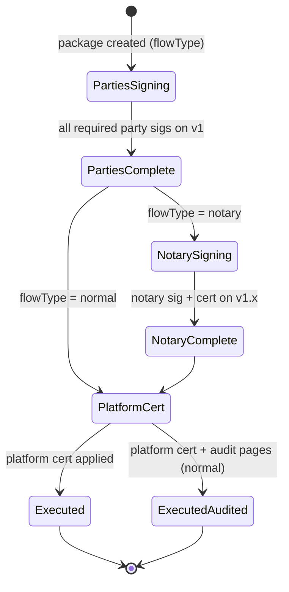

# Document Signing Flows — Normal vs. Notary

> Status: **Draft — plan, not implemented**
> Created: 2026-08-16
> Repo: `diego-yason/pirma`
> Related:
> - `docs/ai/pdfa/pdfa-compliance.md` — PDF/A conversion, artifacts, PAdES, verification
> - `docs/ai/keys/recommendations.md` — signing keys (level-1 session / level-2 persistent)
> - `docs/ai/blockchain/blockchain-integration.md` — anchoring the artifact hash
> - `src/routes/(app)/doc/[pageId]/sign/+page.server.ts` — finalize action

## Purpose

The platform is designed to be expandable into a **legal e-notary platform**. To support that,
there are **two distinct signing flows** that share a common first stage but diverge in who
signs, how the document is versioned, and what certificates/audit pages are produced. Every
flow produces **PDF/A artifacts** with **PAdES-embedded signatures** and per-artifact hashing
(see `pdfa-compliance.md`).

## Versioning model

- **v1** — the PDF/A document produced at ingestion (the "original" that signers see/sign).
- **v1.x** — a **superseding revision** of v1. Only the **notary flow** produces v1.x (e.g. a
  corrected/annotated copy that the notary signs). Normal documents never produce v1.x.
- Each version is a distinct **PDF/A artifact** with its own storage path and SHA-256 hash.

## Flow A — Normal documents

No notary involvement. Produces a single signed document version (`v1`).

```
1a, 1b, 1c, ...   party signatures + individual certificates, on the v1 document
2                 platform certificate, with additional "audit" pages
```

1. **Step 1 (parties)** — each signer signs the **v1** document:
   - PAdES signature embedded in the PDF/A (per signer).
   - An **individual certificate** is produced per signer (a PDF/A certificate page + signed
     metadata): signer identity, timestamp, key fingerprint, artifact hash.
   - The document is flattened after each signature; subsequent signers sign the accumulated
     artifact (ordering is governed by `signing_group` / `signingOrderEnabled`).
2. **Step 2 (platform)** — after all parties:
   - The **platform certificate** is applied to the final artifact.
   - **Audit pages are appended**: pages that record the verification trail (who signed,
     when, key fingerprints, artifact hashes, and — once wired — the blockchain anchor).
   - Final artifact = `v1` fully signed with audit pages.

## Flow B — Notary

Adds a notary step between the parties and the platform. Produces a **v1.x** revision.

```
1a, 1b, 1c, ...   party signatures + individual certificates, on the v1 document
2                 notary signature + certificate, on the v1.x document
3                 platform certificate (NO audit pages)
```

1. **Step 1 (parties)** — identical to Flow A: party signatures + individual certificates on
   **v1**.
2. **Step 2 (notary)** — the notary signs **v1.x** (a revision of v1):
   - The notary may append/correct content (v1 → v1.x) before signing.
   - Notary PAdES signature + **notary certificate** (notary license/ID, jurisdiction,
     timestamp, key fingerprint, artifact hash).
3. **Step 3 (platform)** — the platform certificate on the final **v1.x** artifact.
   - **No audit pages** in the notary flow (the notary step is the attestation; audit pages
     are a normal-flow-only feature).

## What a "certificate" is

In both flows, a **certificate** is a PDF/A artifact/page plus signed metadata:

- Signer identity (name/email, or notary license for the notary cert).
- Signature timestamp (and TSA counter-signature for PAdES-T).
- Signing key fingerprint (level-2 persistent key, see `keys/recommendations.md`).
- The **artifact hash** it is bound to.
- Embedded as a **PAdES signature** over the relevant PDF/A artifact (so it's self-verifying).

**Blockchain transmission:** once a certificate has been received/issued, it is also
**transmitted to the blockchain** — the certificate's own hash is anchored (alongside the
document artifact hash), so every attestation is independently time-stamped and tamper-evident,
not just the document. This applies to **party**, **notary**, and **platform** certificates.

Certificate kinds: **party certificate** (Flow A step 1, Flow B step 1), **notary
certificate** (Flow B step 2), **platform certificate** (Flow A step 2, Flow B step 3).

## Mapping to the PDF/A plan

| Flow element | pdfa-compliance.md mapping |
|---|---|
| Each signature | PAdES-BASELINE-B/-T embedding (Phase 3) |
| Each certificate | A PDF/A certificate artifact/page, signed (Phase 2/3) |
| v1 / v1.x artifacts | `document_artifacts` rows with `kind` + `storagePath` + `hash` |
| Audit pages (normal only) | Generated by the platform cert step; PDF/A-2b (A-3b if we attach the audit XML) |
| Anchoring | The **final artifact hash** (v1 or v1.x) **and every certificate's hash** are blockchain-anchored — certificates are transmitted to the chain as they are issued |
| Verification | `/verify` checks PDF/A + PAdES + cert + artifact-hash ECDSA + anchor |

## Data model implications

```ts
// documents
flowType: enum("normal" | "notary"),        // determined at package creation
currentVersion: text("current_version"),    // "v1" or "v1.x"

// document_artifacts (version + kind history)
kind: enum("original" | "pdfa" | "signed" | "certificate" | "executed"),
version: text("version"),                    // "v1" | "v1.x"
storagePath, hash, createdAt, createdBy,

// signatures
artifactHash,                               // hash of the artifact this sig belongs to
signatureFieldName,                         // PAdES field
certificateStoragePath,                     // individual certificate artifact
role: enum("signer" | "notary" | "platform"),

// packages
notaryUserId: uuid references user,         // Flow B only, nullable
```

## State machine / ordering



- **Normal:** Parties → Platform cert + audit pages → Executed (with audit pages).
- **Notary:** Parties → Notary (v1.x) → Platform cert (no audit pages) → Executed.

## Open questions

1. **Notary identity** — how the notary is assigned/linked to a package (existing `userId`? a
   separate `notaries` table with license/jurisdiction?).
2. **v1.x mechanics** — who can create the revision, and are party signatures re-attached or
   preserved from v1?
3. **Audit page content** — which fields go on the audit pages (signer list, fingerprints,
   timestamps, anchor proof?) and whether audit data is also attached as a file (A-3b).
4. **Multi-certificate PAdES** — whether each certificate is a separate embedded signature on
   one artifact vs. separate certificate artifacts chained by hash. (Recommend separate
   artifacts + hash chain for auditability.)
5. **Migration path to e-notary** — start with `flowType` on packages so the UI/model is ready
   before notary features ship.
