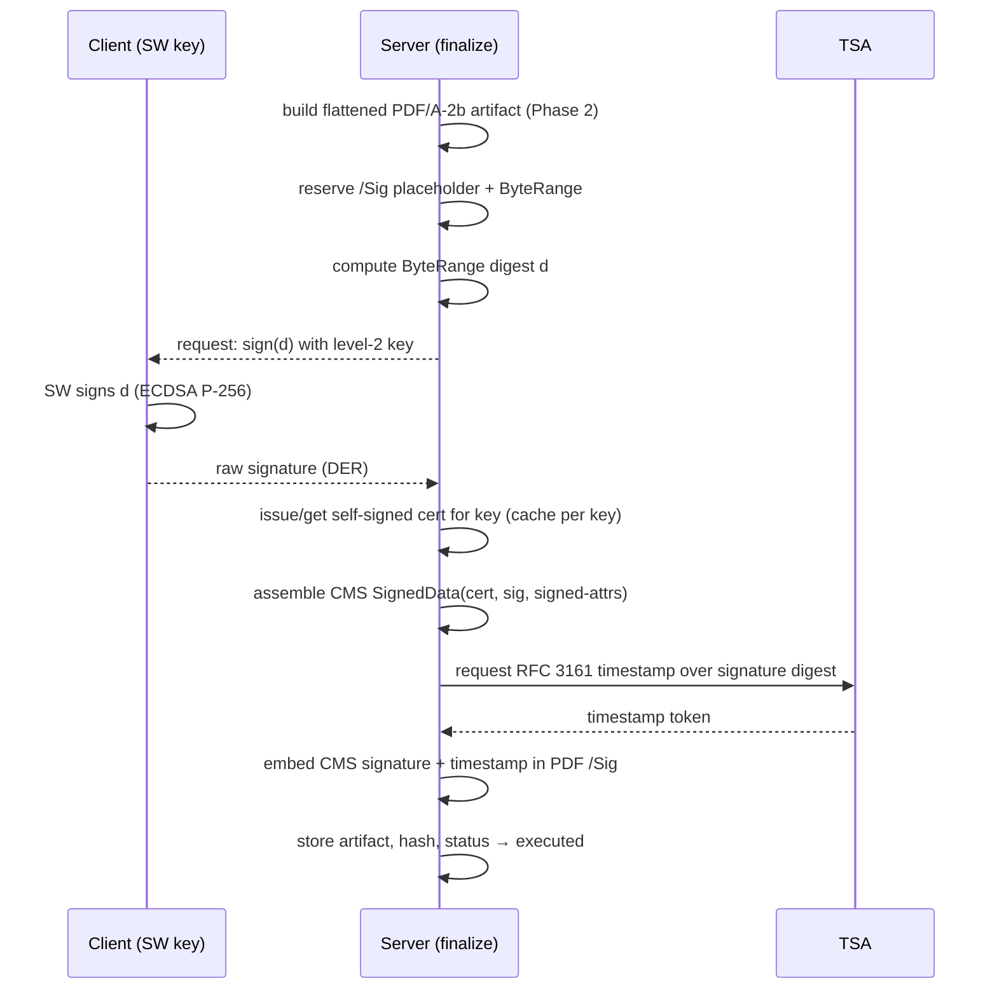

# PAdES-BASELINE-T Signing — Implementation Spec

> Status: **Spec (for review — not implemented)**
> Created: 2026-08-16
> Repo: `diego-yason/pirma`
> Parent: `docs/ai/pdfa/pdfa-compliance.md`, `docs/ai/keys/recommendations.md`, roadmap §3 / §6

## 0. Locked decisions (2026-08-16)

| Decision | Choice |
|---|---|
| Signing-certificate strategy | **Self-signed X.509 per signer** (signed by the signer's own ECDSA key) |
| Trust anchor | **RFC 3161 trusted timestamp (TSA)** — the timestamp, not the cert, carries third-party trust |
| PAdES profile | **PAdES-BASELINE-T** (ETSI EN 319 142-1) |
| Architecture | **In-process** (WASM/Node libraries; serverless-friendly) — document microservice deferred |
| PDF/A level | **A-2b** (allows transparency + embedded digital signatures) |
| Signing key | The signer's **existing ECDSA P-256 key** (`user_keys.pubkey`, SPKI) |
| Signature model | **PAdES-only (Option B, 2026-08-23)** — replaces the custom text-payload detached signature; the anchor targets the artifact hash |

## 1. Scope

Produce, for each executed document, a **flattened PDF/A-2b artifact** whose signature is an
**embedded PAdES-BASELINE-T** CMS signature, made with a **self-signed signer certificate** and
backed by a **trusted timestamp**.

> **Decision (2026-08-23) — Option B: PAdES replaces the custom text-payload signature.**
> The document's electronic signature is a standards-based **PAdES** (ETSI EN 319 142-1)
> signature embedded in the PDF/A artifact — **only**. No detached ECDSA over the custom text
> payload (`signatures.signature_payload`, `buildSigningPayload`) is produced for new documents;
> that payload is retired (the values it bound are flattened into the artifact, so the PAdES
> ByteRange digest covers them). The blockchain anchor targets the **artifact hash**
> (`documents.signedArtifactHash`). Pre-PAdES rows (none in production — no real users) verify
> via their stored detached signature.

Out of scope for this first cut:

- PAdES-BASELINE-LT / -LTA (cert-chain + revocation embedding).
- Platform CA or external CA certs.
- The notary/journal (private-chain ROR) paths.

## 2. Why self-signed + TSA is viable

- The self-signed cert attests **which key** signed; it does **not** prove identity through a CA.
- The **timestamp token** proves the signature existed at a trusted time and remains verifiable
  after the cert's nominal expiry — this is what makes the result meaningful long-term.
- Identity binding comes from the platform's own records (recipient linkage + audit trail), not
  from the certificate.

## 3. Prerequisites (blocking gaps to close first)

1. **A persistent signing key.** PAdES signing should use the signer's **level-2 persistent key**,
   not the ephemeral level-1 session key. Today level-2 keys are never used for signing
   (`loadKeys` skips them; `finalize` always posts `keyLevel: 1`). This must be enabled first.
2. **PDF/A-2b ingestion (roadmap Phase 1)** — the artifact pipeline assumes the document is
   already PDF/A or can be converted (see `pdfa-compliance.md` Phase 1/2).
3. **A TSA endpoint** (see §10 — the only remaining external dependency decision).

## 4. Data model changes

- `user_keys` (or new `signing_certificates`): store the self-signed cert per key —
  `certificatePem text`, `certificateSerial text`, `certificateIssuedAt timestamp`,
  `certificateExpiresAt timestamp`.
- `documents`: add `signedArtifactPath text`, `signedArtifactHash text` (the flattened,
  PAdES-signed PDF/A), `signedAt timestamp`. The anchor targets `signedArtifactHash`.
- `signatures`: **retire `signaturePayload` / `signatureAlgorithm`** (the detached text-payload
  signature) — Option B. The row keeps `signedFields`, `fieldValues`, `documentHash`, `status`,
  `signedAt`, `cryptoKey`; the electronic signature lives in the artifact. No real users, so the
  columns are dropped (or made nullable) in the migration.

## 5. Modules to build

| Module | Responsibility | Candidate tooling |
|---|---|---|
| `lib/server/pades/cert.ts` | Issue self-signed X.509 for an SPKI public key | `@peculiar/x509` (or `node-forge`) |
| `lib/server/pades/cms.ts` | Assemble CAdES/CMS `SignedData` around a raw ECDSA signature | `@peculiar/cms`, `pkijs` |
| `lib/server/pades/tsa.ts` | Request/verify an RFC 3161 timestamp token | `@peculiar/tsp` or a small HTTP client |
| `lib/server/pades/sign.ts` | Orchestrate: prepare PDF → client sign → CMS → TSA → embed | `@signpdf/signpdf` + `pdf-lib` |
| `lib/server/pades/verify.ts` | Verify PDF/A + PAdES (ECDSA verified inside the CMS) + anchor | `veraPDF`/`pdfcpu` + CMS verify |

## 6. End-to-end signing flow (PAdES-T)



Key point: **finalize becomes a two-step round-trip** (server prepares → client signs the
ByteRange digest → server assembles/embeds). This is a structural change from today's single POST.

## 7. Certificate issuance

- On first sign (per key), generate a self-signed cert:
  - Subject: `CN=<user name/email>, O=Pirma`.
  - Public key: the key's SPKI from `user_keys.pubkey`.
  - Signature algorithm: ECDSA-SHA256 (P-256).
  - Validity: long enough to outlive the signing session (e.g. 3 years) — the timestamp is the
    real longevity anchor, so exact expiry is not security-critical.
  - Serial: random; store PEM + serial + dates on the key row.
- Cache the cert on the key row; reuse until the key rotates (rotation already revokes the key,
  so a new cert is issued for the new key).

## 8. Timestamping

- `TSA_URL` env var; request an RFC 3161 `TimeStampReq` over the **signature value digest**,
  receive a `TimeStampResp` token.
- Embed the token as the CMS `signature-time-stamp` unsigned attribute (ETSI EN 319 142-1).
- Verify the token against the TSA's certificate (bundle the TSA cert for verification).

## 9. Verification

For each executed artifact, run:

1. **PDF/A-2b conformance** — `veraPDF` (or `pdfcpu validate`).
2. **PAdES-T** — validate the CMS signature over the ByteRange (the signer's ECDSA verification
   is intrinsic to the CMS), check the timestamp token and its chain to the TSA root.
3. **Blockchain anchor** — `signatures.anchored` on the artifact hash (roadmap §2). No detached
   ECDSA step — retired under Option B.

## 10. Config

```
TSA_URL=                        # RFC 3161 TSA endpoint (dev: freeTSA; prod: commercial TSA)
PADES_CERT_VALIDITY_DAYS=1095   # self-signed cert lifetime
```

## 11. Phased implementation steps

1. **Prereq**: enable level-2 key signing (unlock + sign with the persistent key).
2. **Cert module** — self-signed X.509 issuance from SPKI, persisted on the key row.
3. **CMS + TSA module** — build CAdES SignedData and request/embed the timestamp.
4. **Two-step finalize** — server prepare → client sign ByteRange digest → server embed.
5. **Artifact storage** — write the signed PDF/A artifact + hash to `documents` (and storage).
6. **Verification** — veraPDF + PAdES + anchor checks (no detached ECDSA — Option B).
7. **Tests** — unit (cert/CMS/TSA) + e2e (sign → verify).

## 12. Open questions (after this spec)

1. **Which TSA provider?** freeTSA for dev is fine; production needs a commercial TSA
   (DigiCert/GlobalSign/etc.) or a self-hosted TSA. This is the one remaining external choice.
2. **Signature placeholder size** — reserve enough bytes for CMS + timestamp (e.g. 8–16 KB).
3. **Cert subject format** — name/email vs. a pseudonymous identifier (privacy).

## 13. Security notes

- The self-signed cert is **not** a claim of identity — do not present it as CA-verified.
  Identity rests on platform records + the trusted timestamp.
- Timestamps must come from a **trusted TSA** and be validated with its certificate chain.
- The ByteRange digest must be signed inside the SW with the persistent key; never ship the
  private key to the server.
- Keep the anchor (on the artifact hash) as independent, failure-isolated evidence so a PAdES
  verification failure doesn't also lose the trail. No detached ECDSA under Option B.
