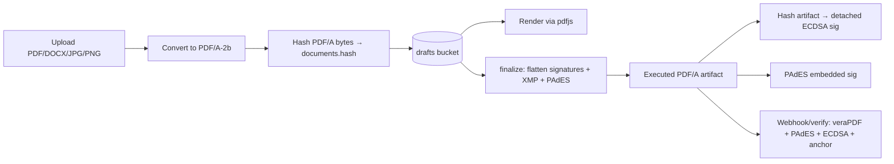

# PDF/A Compliance — Plan (including the signature system)

> Status: **Draft — plan for review, not implemented**
> Created: 2026-08-16
> Repo: `diego-yason/pirma`
> Related:
> - `docs/ai/keys/recommendations.md` — signing-key architecture (level-1 session / level-2 persistent)
> - `docs/ai/blockchain-integration.md`, `docs/ai/blockchain-microservice/` — hash anchoring
> - `src/routes/(app)/doc/new/+page.server.ts` — ingestion + hashing + storage
> - `src/routes/(app)/doc/[pageId]/sign/+page.server.ts` — finalize/signature storage
> - `src/lib/client/ui/PDFViewer.svelte`, `src/routes/(app)/doc/new/+page.svelte` — client rendering

## 1. Goal

Make every **stored and delivered** document PDF/A compliant, and make the signature system
produce artifacts that are verifiable against the PDF/A standard:

1. Convert arbitrary uploads (PDF, DOCX, JPG, PNG) to a **PDF/A** document at ingestion.
2. When a document is signed, produce a **flattened signed PDF/A artifact** (signature images
   burned in, metadata/XMP updated) that is also **PDF/A compliant**.
3. Embed the electronic signature into the artifact as a **PAdES** signature (or, at minimum,
   keep the detached ECDSA signature but sign the *final artifact hash* so it stays meaningful).
4. Provide a **verification path**: PDF/A conformance + PAdES validity + ECDSA detached
   signature + blockchain anchor.

## 2. Current state (what exists today)

| Step | Where | What happens | PDF/A status |
|---|---|---|---|
| Upload | `doc/new/+page.server.ts` | Accepts PDF/DOCX/JPG/PNG; SHA-256 of **raw bytes**; stores raw file in `drafts` bucket | ❌ none |
| Page count | `doc/new/+page.svelte` | `pdf-lib` reads page count client-side | — |
| Render | `PDFViewer.svelte` | `pdfjs-dist` renders raw PDF + overlay placement fields | — |
| Sign | `sign/+page.server.ts` `finalize` | Stores **metadata only**: `signedFields`, `documentHash`, ECDSA sig over `"${docHash}:${fieldCount}"` | ❌ PDF file never touched |
| Signature image | `user_signatures` → `signatures` bucket | PNG/JPEG/GIF/WebP stored, placed client-side | — |
| Verify/Anchor | `signatures.status` / blockchain spec | Not yet implemented (`anchored` never set) | — |

**Key facts:**
- No conversion/normalization happens anywhere — DOCX/JPG/PNG are stored as-is and aren't
  PDF/A (and aren't even renderable by the PDF viewer today).
- Signing never modifies the PDF: there is no flattened "signed document" artifact.
- The ECDSA signature is **detached** (over the file hash), not embedded in the PDF.
- Storage buckets: `drafts` (documents), `signatures` (signature images).

## 3. What PDF/A compliance means (and the level to pick)

PDF/A is an ISO standard for long-term archival of PDFs (ISO 19005). Key requirements:

- All fonts embedded.
- No JavaScript, no encryption, no external content references.
- Device-independent or calibrated color; an `OutputIntent` for spot/CMYK.
- XMP metadata present and internally consistent (`pdfaid:part` / `pdfaid:conformance`).
- Document metadata consistent with XMP.
- No hidden/transparent content that breaks archiving (level-dependent).

**Levels:**

| Level | Notes | Fit for a signing platform |
|---|---|---|
| A-1b (PDF 1.4) | Basic; no transparency, no digital signatures in practice | Too restrictive (no transparency) |
| **A-2b (PDF 1.7)** | Allows transparency + **digital signatures** | **Recommended default** |
| A-3b | A-2b + allows arbitrary embedded files | Optional upgrade: attach audit/XML trail |

**Recommendation:** target **PDF/A-2b**. It is the pragmatic level for a signing product —
it permits the transparency needed for overlaid signature images and supports embedded
digital (PAdES) signatures. Consider **A-3b** only if you want to attach machine-readable
audit metadata (e.g., the JSON signature payload or an XML audit trail) as a file attachment.

## 4. Tooling decision (conversion + signing)

The project uses `adapter-auto` (serverless-capable), so **system binaries on the web server
are not guaranteed** in all targets. Options:

| Tool | What it does | Deployability | Verdict |
|---|---|---|---|
| **Ghostscript** (`gs -dPDFA=2`) | Best-in-class PDF/A conversion; needs a system binary | VM/container only | Preferred if we run a service/container |
| **mupdf** (WASM, npm `mupdf`) | Can open/convert/sign PDFs, incl. PDF/A; runs in-process/WASM | Serverless-friendly | Preferred in-process option |
| **LibreOffice headless** | DOCX → PDF conversion (then PDF/A) | VM/container only | Needed for DOCX inputs |
| **pdf-lib** | Flatten images + set metadata; **cannot** produce true PDF/A | In-process | Use for flattening/metadata, not conformance |
| **veraPDF** / `pdfcpu validate` | PDF/A conformance validation | VM/container / binary | Validation tooling |
| `@signpdf/signpdf` (+pdf-lib) | PAdES-BASELINE-B/-T embedded signatures in Node | In-process | For PAdES embedding |

**Recommendation:** two viable architectures:

- **(A) In-process (serverless):** `mupdf` (WASM) for conversion + PDF/A, `pdf-lib` for
  flattening, `@signpdf/signpdf` for PAdES. No system deps. Best fidelity for DOCX is
  limited (needs a conversion step).
- **(B) Document microservice (recommended for production):** a small service (Node or
  container) running Ghostscript + LibreOffice + veraPDF, mirroring the existing
  blockchain-microservice pattern. Best fidelity, cleaner separation, and you already have
  the service-integration muscle.

**Plan assumes (A) for a first cut, with (B) as the production path.** Confirm before
implementing (see §10).

## 5. Target pipeline



## 6. Phased plan

### Phase 1 — Ingestion conversion (upload → PDF/A)
- Add a server-side conversion step in `doc/new/+page.server.ts` (or a service):
  - **PDF** → validate it's a PDF, convert to PDF/A-2b (Ghostscript/mupdf).
  - **JPG/PNG** → embed into a single-page PDF, then PDF/A.
  - **DOCX** → LibreOffice → PDF → PDF/A (Phase 1 can reject DOCX if conversion isn't ready).
- Recompute SHA-256 **after** conversion; store the converted PDF/A bytes (not the raw file).
- Update `documents`: `pdfAVersion` (`"A-2b"`), `pdfACompliant` (bool), `convertedAt`.
- Keep the original bytes only if audit needs it (a separate `document_artifacts` version).
- Set document metadata (title, creator) + XMP `pdfaid:part=2 / conformance=B`.

### Phase 2 — Signed artifact generation (flatten)
- On `finalize` in `sign/+page.server.ts`, after signatures are verified:
  1. Load the PDF/A document + each signer's signature image.
  2. **Flatten** each signature image at its placement rect (pdf-lib or mupdf).
  3. Update XMP/document info: add signer name, `SignedAt` timestamp, signer count.
  4. **Re-convert to PDF/A** if the flattening library degraded conformance (mupdf/Ghostscript
     re-pass), then store the artifact (e.g., `executed/` bucket) with a fresh hash.
- Record per-document artifact path + artifact hash.

### Phase 3 — Signature system (embedded + detached)
- **PAdES (recommended):** embed a PAdES-BASELINE-B signature (CMS/PKCS#7, ECDSA-SHA256 or
  RSA-SHA256) per signer via `@signpdf/signpdf` (or mupdf). Add a TSA timestamp for
  PAdES-T. This requires a **signing certificate (X.509)** — decide: self-signed per user, or
  a platform CA. **Open decision** (see §10).
- **Detached (fallback/compat):** keep the existing ECDSA system but sign the **final
  artifact hash** (Phase 2 output) instead of the pre-flattened `documents.hash`. Update
  `buildSigningPayload` to bind the artifact hash + sorted field IDs (§9 keys doc).
- `signatures` gains: `padesSignatureBytes`, `signatureFieldName`, `padesValidated`,
  `artifactHash`, `flattenedAt`.

### Phase 4 — Verification
- New verification endpoint/page (`/verify`, `GET /api/verify/...`):
  1. PDF/A conformance (veraPDF/pdfcpu) — stored result or on-demand.
  2. PAdES signature validity + cert chain.
  3. Detached ECDSA over artifact hash.
  4. Blockchain anchor status (existing spec).
- Store `proofJson`/validation results with the artifact.

### Phase 5 — Config, schema, tests
- Env/config: `PDFA_LEVEL` (`A-2b`), `PDFA_TSA_URL`, `DOC_SERVICE_URL`, etc.
- Migrations: `documents` (+`pdfAVersion`, `pdfACompliant`, `convertedAt`,
  `artifactStoragePath`, `artifactHash`), `signatures` (+PAdES fields), new
  `document_artifacts` (version history) if needed.
- Tests: conversion determinism (same input → stable), PDF/A validation on output, signature
  verification round-trip, hash-stability after flattening.

## 7. Data model changes (proposed)

```ts
// documents — additions
pdfAVersion: text("pdf_a_version"),        // "A-2b"
pdfACompliant: boolean("pdf_a_compliant").default(false),
convertedAt: timestamp("converted_at"),
artifactStoragePath: text("artifact_storage_path"), // flattened signed PDF/A
artifactHash: text("artifact_hash"),

// signatures — additions
artifactHash: text("artifact_hash"),          // hash of the signed PDF/A artifact
padesSignatureBytes: text("pades_signature_bytes"), // base64 CMS signature / field ref
signatureFieldName: text("signature_field_name"),   // PDF AcroForm field per signer
padesValidated: boolean("pades_validated").default(false),
flattenedAt: timestamp("flattened_at"),

// optional — version history
documentArtifacts = pgTable("document_artifacts", {
  id, documentId, kind: enum("original"|"pdfa"|"signed"|"executed"),
  storagePath, hash, createdAt, createdBy,
})
```

## 8. Interaction with the existing signature/key system

- The **level-2 (persistent, password-bound) key** is the natural candidate for producing the
  PAdES signature (higher assurance). Level-1 (session) keys remain for lightweight/guest
  signing.
- The **blockchain anchoring** should anchor the **artifact hash** (the actual delivered PDF/A
  bytes), not the raw upload hash, so the on-chain proof covers what the signer saw/signed.
- The **signing payload** should bind the artifact hash + sorted signed field IDs (see
  `docs/ai/keys/recommendations.md` #9).

## 9. Risks & open questions

1. **Signing certificate for PAdES** — self-signed per user vs. platform CA vs. external TSP.
   PAdES with a raw ECDSA key is not standard; a certificate is required. **Decision needed.**
2. **Where conversion runs** — in-process WASM (serverless) vs. document microservice
   (production). Affects DOCX fidelity and validation tooling.
3. **DOCX/JPG/PNG support** — convert at upload, or reject non-PDF inputs in Phase 1?
4. **PDF/A level** — A-2b (recommended) vs A-3b (attachments).
5. **Re-conversion risk** — flattening via pdf-lib may break PDF/A; a re-pass (mupdf/Ghostscript)
   after flattening is needed. Budget for it.
6. **Validation tooling in serverless** — veraPDF is Java; may only run in the microservice.
7. **Hash stability** — converting/flattening changes bytes; all consumers of `documents.hash`
   (signing payload, blockchain payload) must point at the final artifact hash.
8. **Existing documents** — backfill: convert already-uploaded docs on demand vs. only new ones.

## 10. Implementation checklist

- [ ] Confirm PAdES signing-cert strategy (§9.1) and conversion architecture (§9.2).
- [ ] Pick PDF/A level (default A-2b) and DOCX/image policy (§9.3).
- [ ] Add `pdfAVersion`, `pdfACompliant`, `convertedAt`, artifact fields to schema; migration.
- [ ] Implement ingestion conversion in `doc/new/+page.server.ts` (or doc-service).
- [ ] Recompute hash post-conversion; store PDF/A bytes; set XMP/`pdfaid`.
- [ ] Implement flattening in `finalize` + artifact generation + re-convert to PDF/A.
- [ ] Implement PAdES embedding (or detached sig over artifact hash) per decision.
- [ ] Update `buildSigningPayload` to bind artifact hash + sorted field IDs.
- [ ] Update blockchain anchoring to use the artifact hash.
- [ ] Add `/verify` endpoint + page (PDF/A + PAdES + ECDSA + anchor).
- [ ] Backfill policy for existing documents (§9.8).
- [ ] Tests: conversion determinism, PDF/A validation, signature round-trip, hash stability.
