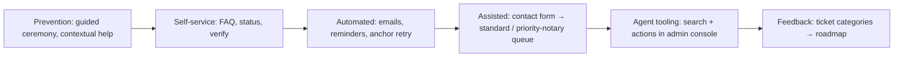

# User Support — Parties & Notaries

> Status: **Draft — design, not implemented**
> Created: 2026-08-16
> Repo: `diego-yason/pirma`
> Related:
> - `docs/ai/signing/email-notifications.md` — transactional email backbone (this doc extends its email set)
> - `docs/ai/notary/notary.md` — commission, journal, ION (notary support context)
> - `docs/ai/identity/guest-tokens.md` — guest tokens, expiry, email binding (party support context)
> - `docs/ai/signing/signing-ux.md` — guided ceremony, accessibility (prevention)
> - `docs/ai/identity/audit-trail.md` — event log for support/agent actions
> - `docs/ai/roadmap.md` §8.6 (admin console) + §8.8 (support & help)
> - `docs/ai/compliance/compliance-and-public-api.md` — disclosures (support copy)

## Purpose

Define how the platform helps **parties** (signers, frequently one-time guests) and **notaries**
(licensed, compliance-critical professionals) before, during, and after a signing/notarization.
Strategy: **prevention → self-service → automated → assisted**, with a heavier assisted tier for
notaries. Most of the machinery already exists or is planned in the email loop, guided ceremony,
verify page, and admin console; the genuinely new pieces are a help center, an in-app support
form, a priority notary channel, and support-agent tooling.

## 1. Personas & needs

| | **Party (signer)** | **Notary** |
|---|---|---|
| Volume / frequency | High, one-time, often guest | Low, recurring |
| Tech familiarity | Low — first-time signing | High — but legally liable |
| Failure cost | Low (re-invite) | High (compliance, commission, journal) |
| Channel | Self-service + FAQ + automated | Assisted, priority, audited |
| Typical issues | "How do I sign?", lost/expired link, OTP, mobile/fields, "what happens next?" | Commission onboarding/expiry, ack vs jurat, anchoring failures, journal/ROR export, verify/QR |

## 2. Support layers



1. **Prevention** — reduce tickets at the source (guided ceremony, clear copy).
2. **Self-service** — per-persona FAQ/help center, status pages, verify page, journal export.
3. **Automated** — transactional emails (extend `email-notifications.md`), anchor-failure retry.
4. **Assisted** — in-app contact form with auto-attached context; two queues.

## 3. Prevention & in-flow guidance

- **Guided signing ceremony** (`signing-ux.md` §8.2): field-by-field navigation + completion
  checklist + finish gate. Reduces "where do I sign?" tickets.
- **Contextual help**: a "?" next to ack/jurat for notaries; a plain-language "You're signing
  `X` for `Y`" intro for parties; per-field hints.
- **Status / empty states** that answer "what's next": after signing → executed → certificate →
  verify. The verify page (`notary.md` §4, roadmap §2) doubles as the self-service "is this
  real?" answer for parties and third parties.
- **Help center** (static routes, no DB): `(public)/help/party` + `(public)/help/notary` —
  render simple markdown. Party FAQ: expired/lost link, OTP, mobile/browser, fields, what
  happens after signing. Notary FAQ: commission onboarding, ack vs jurat, ION steps, journal
  (ROR) export, anchoring status.

## 4. Automated & proactive support

Extends the email set in `email-notifications.md` (all provider-agnostic behind the existing
`src/lib/server/email` module + `email_events` logging):

| # | Email | Trigger | To | Notes |
|---|---|---|---|---|
| 8 | **Link expired** | Guest token rejected at verify | Party | Explains the expiry + "request a new link" (owner re-invite); never includes the token |
| 9 | **Deadline warning** | Before `packages.expirationDate` | Owner + outstanding signers | Soft warning; hard vs. soft deadline is an open decision |
| 10 | **Notary commission expiry** | Cron: e.g. 60/30/7 days before `commissionExpiresAt` | Notary | Links to renewal/submission; prevents an involuntary lapse mid-act |

- **Anchor-failure UX** (roadmap §2 banner + manual re-submit): surface failures as an
  *actionable* notary task — "Anchor failed — retry / contact support" with `anchorId` and
  journal entry number pre-loaded.
- **OTP / token self-service**: resend OTP (planned in `guest-tokens.md`) and clear
  "link invalid/expired → request a new one" paths.

## 5. Assisted support

- **In-app "Contact support" form** (`(public)/support`, POST `/api/support/tickets`) that
  auto-attaches context to cut back-and-forth:
  - Party: `packageId`, recipient email, guest-token state (never the token itself), browser/OS.
  - Notary: `packageId`, `notarizationId`, `anchorId`, journal entry number, commission state.
- **Two queues** (DB-backed `priority` column):
  - **Standard** — parties; email-first resolution.
  - **Priority notary** — notaries; faster SLA, because an in-progress ION shouldn't wait.
- **Escalation path** to compliance/legal for disputed notarizations — hand off evidence
  (package, journal entry, anchor proof), not just a reply thread.

## 6. Support-agent tooling (admin console — roadmap §8.6)

Agents resolve tickets in the admin console:

- **Search by**: package ID, recipient email, guest-token `jti`, `anchorId`, journal entry
  number, ticket ID — linked from the ticket's `contextJson`.
- **Actions**: re-send invite, regenerate/revoke a guest token (safe because
  `guestTokens.revokedAt` + email binding are decided in `guest-tokens.md`), manually
  re-anchor, mark package `void`.
- **Audit**: every agent action is written to the audit trail (`audit-trail.md`) — who on staff
  touched which package is itself a compliance event.

## 7. Schema (drizzle-style additions)

```ts
supportTickets = pgTable("support_tickets", {
  id: uuid("id").primaryKey(),
  userId: uuid("user_id").references(() => user.id),      // null for guests
  role: text("role").notNull(),                            // "party" | "notary"
  contactEmail: text("contact_email"),                     // captured for guests
  packageId: uuid("package_id").references(() => packages.id),
  recipientId: uuid("recipient_id").references(() => packageRecipients.id),
  notarizationId: uuid("notarization_id").references(() => notarizations.id),
  anchorId: text("anchor_id"),                             // anchoring context
  subject: text("subject").notNull(),
  message: text("message").notNull(),
  contextJson: jsonb("context_json").notNull().default({}), // PII-minimized: browser/OS, errorRef, deviceHash
  priority: text("priority", { enum: ["standard", "priority"] }).notNull().default("standard"),
  status: text("status", { enum: ["open", "in_progress", "resolved", "closed"] }).notNull().default("open"),
  resolution: text("resolution"),
  assignedTo: uuid("assigned_to").references(() => user.id), // staff
  createdAt: timestamp("created_at").notNull().defaultNow(),
  resolvedAt: timestamp("resolved_at"),
  closedAt: timestamp("closed_at"),
})

supportTicketEvents = pgTable("support_ticket_events", {
  id: uuid("id").primaryKey(),
  ticketId: uuid("ticket_id").references(() => supportTickets.id).notNull(),
  actorType: text("actor_type", { enum: ["user", "agent", "system"] }).notNull(),
  actorUserId: uuid("actor_user_id").references(() => user.id),
  action: text("action").notNull(), // created | assigned | replied | escalated | resolved | closed
  note: text("note"),
  createdAt: timestamp("created_at").notNull().defaultNow(),
})
```

`supportTicketEvents` is the ticket-side audit record; package-facing side effects (re-send,
revoke, re-anchor) are logged in the main audit trail.

## 8. Routes

| Route | Purpose |
|---|---|
| `(public)/help/party` · `(public)/help/notary` | Static help center (markdown-rendered) |
| `(public)/support` | Contact form (guests: capture email) |
| `api/support/tickets` (POST) | Create ticket; auto-derive context from session/guest token |
| `(app)/support` | Logged-in user: their tickets + status |
| `(admin)/support/tickets` | Agent queue (extends admin console §8.6) |

## 9. Privacy & audit

- `contextJson` is **PII-minimized** (hashes + refs, never raw PII where avoidable) — mirrors the
  verify-page rule in `notary.md` §4.
- Tokens/links never appear in tickets, logs, or support replies.
- Staff access + agent actions logged (audit trail); ticket lifecycle logged in
  `supportTicketEvents`.
- Support copies for notaries must not contradict statutory disclosures
  (`compliance-and-public-api.md`).

## 10. Feedback loop

Tag tickets by category (token, email, anchor, fields, auth, billing) at resolve time; a monthly
rollup feeds the roadmap matrix — if "expired link" dominates, it becomes a P1/P2 self-service
item. `supportTickets` should carry a `category` column if this is desired in v1.

## Open decisions

1. **In-house tickets vs. external helpdesk** (Zendesk/Intercom) — in-house keeps context +
  audit in one DB; external is faster to stand up. (Default assumed: in-house v1, export later.)
2. **Guests opening tickets** — allow via captured email (default) vs. owner-mediated only.
3. **Priority-notary SLA** — define response targets (e.g. next business hour vs. 24h standard).
4. **Hard vs. soft `expirationDate`** for deadline warnings (mirrors `email-notifications.md`).
5. **`category` column** on `supportTickets` for the feedback loop (default: include).
6. **Help center tooling** — hand-written markdown (default) vs. a CMS.
7. **Who staffs the notary channel** — platform admin vs. dedicated compliance operator.
