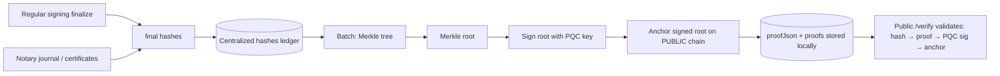

# Post-Quantum Cryptography (PQC) — Future Implementation Note

> Status: **Note / proposed — not implemented**
> Created: 2026-08-19
> Repo: `diego-yason/pirma` · Branch: `dev`
> Related:
> - `docs/ai/blockchain-integration.md` — existing anchoring mechanism this builds on
> - `docs/ai/notary.md` §5 — notary journal / ROR (private chain) included in scope
> - `docs/ai/audit-trail.md` — hash-chained event log (candidate for checkpoint roots)
> - `docs/ai/pdfa/pades-baseline-t-spec.md` — PAdES artifacts / certificate hashes
> - `src/lib/server/db/schema.ts` — `signature_anchors`, `notary_journal_entries` shape

This is a **forward-looking note**, not a commitment. It records the intent and a proposed
shape for a **supplementary** PQC layer that protects the platform's integrity once quantum
computers threaten today's asymmetric signatures. It does **not** replace the existing ECDSA
P-256 / SHA-256 system — it adds an independent, quantum-resistant root of trust **on top** of it.

---

## 1. Why this matters (threat model)

- **Harvest-now, decrypt/forge-later.** Documents signed today use ECDSA P-256. Shor's algorithm
  on a sufficiently large quantum computer can derive private keys from public keys, letting an
  attacker **forge signatures retroactively** on any document we anchored today.
- **Hashes are the resilient part.** SHA-256 is considered safe against Grover's algorithm at
  acceptable security margins (≈128-bit post-quantum), so the *content* hashes remain trustworthy.
  What breaks is the **binding** — the signatures and certificates that tie a hash to a signer/notary.
- **PQC adds a second, quantum-safe binding.** Even if every ECDSA signature is later forged, the
  PQC-signed Merkle root (anchored on a public chain before the quantum threat matures) pins the
  set of final hashes as of the anchor time.

## 2. Concept (one paragraph)

All **final hashes** produced by the platform — from **regular signing** and from **notary** flows —
are collected into a centralized ledger (the existing blockchain/anchoring pipeline). Periodically,
a batch of those hashes is folded into a **Merkle tree**, producing a single **Merkle root**. That
root is **signed with a PQC key** (NIST-standardized ML-DSA or SLH-DSA), and the signature + root +
public-key fingerprint are **anchored in a public chain**. Anyone can later verify an individual
document by recomputing its hash → following its stored Merkle proof → checking the PQC signature
over the root → confirming the root's anchor on the public chain.



## 3. Scope — applies to both

| Flow | What gets aggregated as a leaf |
|---|---|
| **Regular signing** | The per-document anchor `payloadHash` from `blockchain-integration.md` §8 (or per-signature hashes), plus final artifact / PAdES certificate hashes |
| **Notary** | `notary_journal_entries.payloadHash` (journal / ROR) plus notarized artifact hashes and certificate hashes (`sealHash` / QR) from `notary.md` §4–§5 |
| (optional) **Audit** | Periodic `audit_log` checkpoint roots (see `audit-trail.md` "periodically anchor a checkpoint") |

The existing per-document/private-chain anchoring stays as-is; PQC is **additive** — it anchors a
*root over everything* rather than replacing individual anchors.

> **Features page:** when implemented, this must also be surfaced on the public Features page
> (`src/routes/(public)/features/+page.svelte`) — add a PQC card to the **`integrity`** group,
> alongside the existing "Blockchain anchoring" and "Public verification" cards (e.g.
> "Post-quantum protection": the entire platform's hashes are batched into a Merkle root signed
> with a NIST-standardized post-quantum key and anchored on a public chain).

## 4. Merkle aggregation design

- **Batching**: fold final hashes into a Merkle tree on a cadence (e.g. daily, or every N entries),
  or on demand when a batch is closed. Deterministic leaf ordering (sorted by canonical hash) so
  the tree is reproducible.
- **Proofs**: store each leaf's Merkle path (`proofJson`) locally so any single document is
  verifiable offline against the signed root — same spirit as the existing `signature_anchors.proofJson`.
- **PII-free**: leaves are hashes only (document hashes, journal payload hashes). No names, emails,
  or content reach the tree or the chain.

## 5. PQC signature layer

- **Algorithms** (NIST FIPS, standardized 2024):
  - **ML-DSA** (FIPS 204, lattice-based) — compact, fast; good default.
  - **SLH-DSA** (FIPS 205, stateless hash-based) — most conservative; larger signatures.
  - Decision: ML-DSA-65 (security level 3) as the default, SLH-DSA as the ultra-cautious option.
- **Key custody**: the PQC **private key** is generated server-side (ideally in an HSM) and never
  leaves the signing service. The PQC **public key** is anchored on the public chain once; the
  signed root is anchored per batch.
- **Granularity (decision)**: a single platform-wide root vs. per-notary / per-tenant roots
  (separate notary PQC key keeps notarial integrity independent of the platform key).

## 6. Public chain anchoring

- Reuse the anchor mechanism from `blockchain-integration.md` (client, retries, webhook/poll),
  but the anchored payload becomes the **PQC signature over the Merkle root**, plus the root and
  the public-key fingerprint.
- Chain options: any chain storing a small bytestring (Ethereum L2 calldata, Bitcoin `OP_RETURN`,
  etc.) — the existing `chain` config parameter covers this.
- On-chain data stays minimal: root hash, signature, pubkey fingerprint, block/time. No PII.

## 7. Data model (proposal)

```ts
pqcRootAnchors = pgTable("pqc_root_anchors", {
  id: uuid PK,
  batchId: uuid notNull unique,            // closes a Merkle batch
  rootHash: text notNull unique,           // Merkle root (hex)
  rootAlgorithm: text notNull,             // e.g. "ML-DSA-65" | "SLH-DSA-128s"
  rootSignature: text notNull,             // PQC signature over rootHash (base64)
  pubKeyFingerprint: text notNull,         // anchor id for the PQC public key
  chain: text,                             // public chain used
  anchorId: text,
  txHash: text,
  blockNumber: bigint({ mode: "number" }),
  status: enum("submitted"|"pending"|"confirmed"|"failed") notNull default("submitted"),
  proofJson: jsonb,                        // per-leaf proofs (or separate table)
  createdAt: timestamp notNull defaultNow(),
  confirmedAt: timestamp,
})
```

Leaf proofs can live in `proofJson` on the root row or in a separate
`pqc_merkle_leaf_proofs(batchId, leafHash, proofPath)` table keyed by the existing
document/journal hashes.

## 8. Verification

Extend the planned public `/verify` page + API (`blockchain-integration.md` §9):
1. Recomputed leaf hash → look up its Merkle proof → derive the root.
2. Verify the **PQC signature** over the root with the anchored public key.
3. Confirm the root's anchor on the public chain (txHash / blockNumber / timestamp).
Result: an integrity statement that holds even against a future quantum-capable attacker.

## 9. Open decisions (before implementation)

1. **Algorithm & level** — ML-DSA-65 default vs. SLH-DSA for maximal caution; per-flow choice.
2. **Batch cadence** — time-based (daily), count-based (N entries), or event-driven close.
3. **Root granularity** — single platform root vs. per-notary / per-tenant roots.
4. **Key custody** — HSM-managed PQC keys vs. software keys; key ceremony + rotation cadence.
5. **Legacy backfill** — re-anchoring already-signed/notarized hashes into the first batch.
6. **Chain selection** — which public chain(s); cost per anchor vs. batching size.
7. **Standards alignment** — whether the anchored record should follow a structured format
   (e.g. a W3C-style proof / merkle receipt envelope) for interop.

## 10. Implementation checklist (future)

- [ ] Confirm algorithm choice, batch cadence, root granularity, chain (see §9).
- [ ] Add `pqc_root_anchors` (+ optional `pqc_merkle_leaf_proofs`) to `src/lib/server/db/schema.ts`.
- [ ] `pnpm dlx drizzle-kit generate --name add_pqc_root_anchors` + apply migration.
- [ ] Server module: Merkle tree builder over final hashes (regular signing + notary).
- [ ] PQC key generation + custody (HSM or software), pubkey anchoring to public chain.
- [ ] Signing job: build batch → compute root → sign → submit anchor → store proofs.
- [ ] Extend `/verify` (page + API) to validate hash → proof → PQC sig → anchor.
- [ ] Wire leaves from `signature_anchors` and `notary_journal_entries` (and optional audit checkpoints).
- [ ] Add a PQC feature card to the public Features page (`src/routes/(public)/features/+page.svelte`, `integrity` group — see §3 note).
- [ ] Unit tests: Merkle determinism, proof verification, PQC sign/verify round-trip, state machine.
